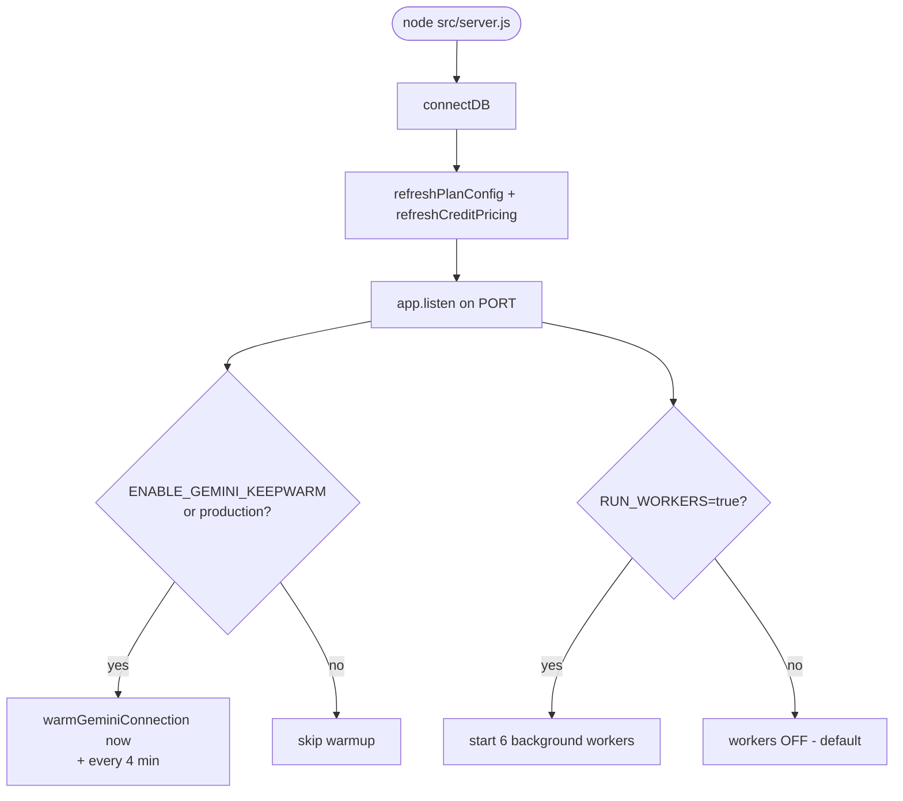
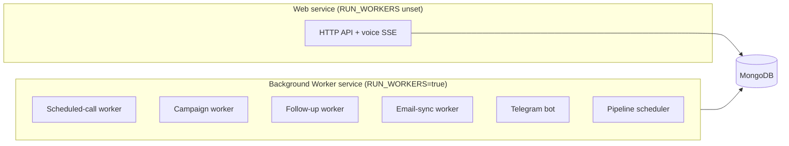
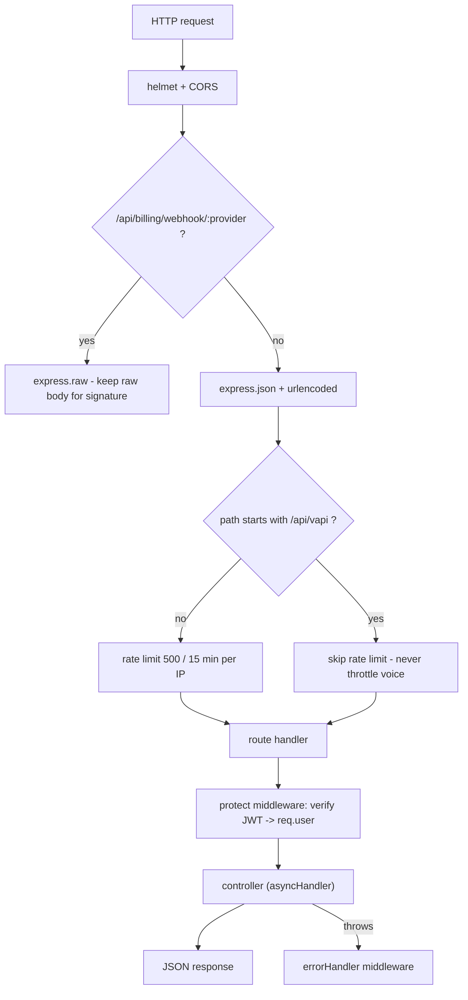

# 01 — Architecture & Runtime

[← Back to index](README.md)

How the backend is wired together, how a request flows through it, and what runs in the background.

---

## Backend entry points

| File | Role |
|------|------|
| `backend/src/server.js` | Boots the process: connects Mongo, warms Gemini, starts HTTP server, wires graceful shutdown, optionally starts background workers |
| `backend/src/app.js` | Builds the Express app: middleware, route mounting, error handlers |
| `backend/src/config/db.js` | Mongo connection |

### Startup sequence



Key ideas:
- **`connectDB()` first, then listen.** If Mongo fails, the process exits.
- **Plan + credit pricing config are refreshed into memory at boot** (`config/plans.js`, `config/creditPricing.js`).
- **Gemini keep-warm** makes a tiny Gemini call at startup and every 4 minutes to keep TTFT (time-to-first-token) low. **ON in production, OFF locally** unless `ENABLE_GEMINI_KEEPWARM=true`.
- **Graceful shutdown:** on `SIGTERM`/`SIGINT` the server stops accepting new connections but lets in-flight SSE voice streams finish (up to `SHUTDOWN_GRACE_MS`, default 30s) so a deploy never cuts a live call mid-sentence.

---

## The web instance vs. the worker instance

The **same codebase** runs in two roles, decided by the `RUN_WORKERS` env var:



Background workers **steal CPU from real-time voice**, so they never run on the web instance. In production they run on a dedicated Render "Background Worker" service (`RUN_WORKERS=true`). Locally they're OFF by default; enable per-need with `RUN_WORKERS=true npm run dev`.

The six workers (started in `server.js`):
- `startScheduledCallWorker()` — see [09](09-followups-scheduled.md)
- `startCampaignWorker()` — see [08](08-campaigns.md)
- `startFollowUpWorker()` — see [09](09-followups-scheduled.md)
- `startEmailSyncWorker()` — see [11](11-email.md)
- `startTelegramBot()` — see [13](13-integrations.md)
- `startPipelineScheduler()` — cron-driven auto-pipeline

---

## Request lifecycle (normal API request)



Important middleware details (all in `app.js`):
- **Payment webhooks are mounted BEFORE `express.json`** so signature verification can read the raw body.
- **`/api/vapi/*` is exempt from rate limiting** — the real-time voice path must never be throttled.
- **`trust proxy = 1`** so per-client IPs (not the proxy IP) are used behind Render.
- Errors bubble to `middleware/error.middleware.js` (`notFound` + `errorHandler`). Controllers are wrapped in `utils/asyncHandler.js`, and failures throw `ApiError(status, message)`.

---

## Layered directory map

```
backend/src/
├── server.js / app.js        — bootstrap + express wiring
├── config/                   — db, plans, credit pricing
├── routes/                   — 1 file per system, maps URL -> controller
├── controllers/              — request handling, validation, orchestration
├── services/                 — business logic (billing, outbound call, leads, campaigns…)
│   ├── billing/              — reserve/settle voice billing
│   ├── llmProviders/         — provider identity + BYOK adapters
│   └── telegram/             — telegram bot
├── engine/                   — Layer B conversation engine (agentRuntime, promptBuilder)
├── llm/                      — Gemini / OpenAI low-level clients
├── providers/               — provider abstraction (Vapi / custom) for calls
├── models/                   — Mongoose schemas
├── middleware/               — auth (protect/admin), error handling
├── workers/ + services/*Worker.js — background jobs
└── utils/                    — apiError, asyncHandler, crypto, phone, token…
```

**The most important boundary:** `controllers/` handle HTTP; `services/` and `engine/` hold logic and are unit-testable without a server. The voice engine (`engine/agentRuntime.js`) is deliberately kept free of HTTP concerns.

---

## Authentication in one line

Every private route is guarded by `protect` (JWT → `req.user`); admin routes add `adminOnly` / `requireSuperAdmin`. Full detail in **[02 — Authentication](02-authentication.md)**.

---

## Where to go next

- The core product: **[04 — Voice Calls](04-voice-calls.md)**
- The engine internals: **[05 — Vapi Webhooks & Engine](05-vapi-webhooks.md)**
- Every model: **[18 — Data Models](18-data-models.md)**
