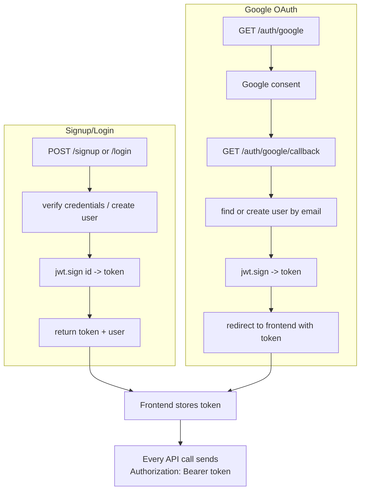
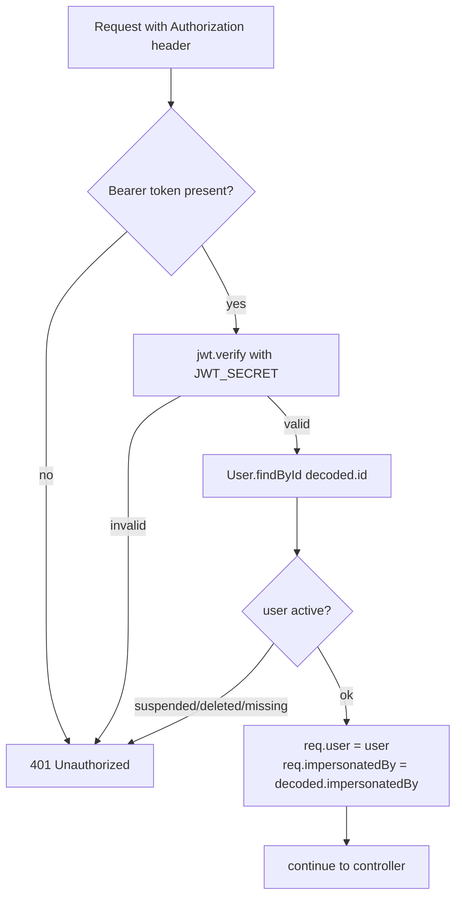

# 02 — Authentication & Users

[← Back to index](README.md)

Who a request belongs to, how they log in, and how routes are protected.

---

## Files

| File | Role |
|------|------|
| `backend/src/routes/auth.routes.js` | Signup, login, Google OAuth, `/me` |
| `backend/src/controllers/auth.controller.js` | Credential handling, token issuing |
| `backend/src/middleware/auth.middleware.js` | `protect`, `adminOnly`, `requireAdmin`, `requireSuperAdmin` |
| `backend/src/models/User.js` | User schema (role, status, plan, credits) |
| `frontend/src/contexts/AuthContext.jsx` | Frontend session state |

---

## Endpoints

| Method | Path | Auth | Purpose |
|--------|------|------|---------|
| POST | `/api/auth/signup` | public | Create account, return JWT |
| POST | `/api/auth/login` | public | Email + password → JWT |
| GET | `/api/auth/google` | public | Redirect to Google consent |
| GET | `/api/auth/google/callback` | public | OAuth callback → JWT → redirect to frontend |
| GET | `/api/auth/me` | `protect` | Load the current user |

---

## Login / token flow

The backend is **stateless JWT** (there is no server-side session store for API auth). The token is a Bearer token sent in the `Authorization` header.

---

## How `protect` works

`middleware/auth.middleware.js` guards every private route:

- `req.user` is the authenticated user document (password stripped).
- `req.impersonatedBy` is set when an admin is impersonating (see [16 — Admin](16-admin.md)).
- Suspended/deleted users are rejected even with a valid token.

### Role guards

| Guard | Allows |
|-------|--------|
| `protect` | any logged-in, active user |
| `adminOnly` / `requireAdmin` | `role ∈ {admin, super_admin}` |
| `requireSuperAdmin` | `role == super_admin` only |

Roles live on `User.role`. Most admin routes use `adminOnly`; destructive/config routes (plan config, wallet credits, integration settings) use `requireSuperAdmin`.

---

## Frontend session

`AuthContext` loads the stored token on app start, calls `GET /api/auth/me` to hydrate the user, and gates protected routes. `useAuth()` must be called **inside** `<AuthProvider>`. See [17 — Frontend](17-frontend.md).

---

## Security notes

- `JWT_SECRET` must be set or `protect` throws 500 (fail-closed).
- Passwords are hashed with `bcryptjs`.
- Secrets stored per user/integration (LLM keys, Twilio tokens, IMAP passwords) are encrypted at rest via `utils/secretCrypto.js` using `SECRET_ENCRYPTION_KEY` — never returned to the browser in plaintext.
