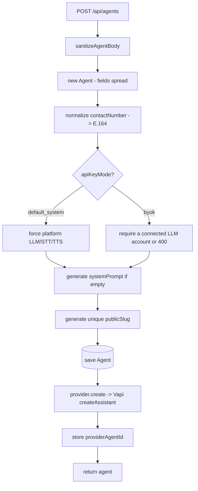
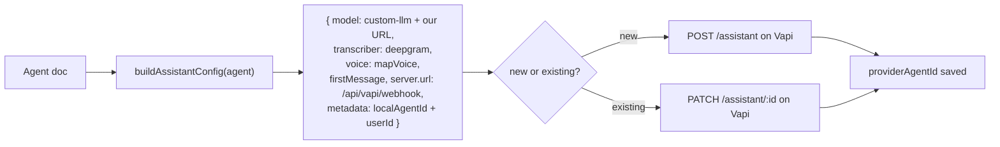

# 03 — Agents

[← Back to index](README.md)

An **agent** is the central object: a configured AI persona (prompt, voice, language, behaviour) that maps to a **Vapi assistant** and drives calls.

---

## Files

| File | Role |
|------|------|
| `backend/src/routes/agent.routes.js` | All agent endpoints |
| `backend/src/controllers/agent.controller.js` | CRUD, sync, test, image, share |
| `backend/src/models/Agent.js` | Agent schema (large — voice, LLM, bio page, telephony…) |
| `backend/src/services/promptGenerator.js` | Builds `systemPrompt` from business fields |
| `backend/src/services/vapi.service.js` | `buildAssistantConfig` + create/update/delete assistant on Vapi |
| `backend/src/providers/index.js` | Provider abstraction (`vapi` / `custom`) |
| `backend/src/services/apiKeyMode.service.js` | `default_system` vs `byok` enforcement |
| `backend/src/models/AgentTemplate.js` | Prebuilt agent templates |

---

## Key endpoints (all under `/api/agents`, `protect`ed)

| Method | Path | Purpose |
|--------|------|---------|
| POST | `/` | Create agent (+ auto-create Vapi assistant) |
| GET | `/` | List my agents |
| GET | `/:id` | Get agent + recent calls/leads + voice/LLM config |
| PUT | `/:id` | Update agent (re-syncs assistant) |
| DELETE | `/:id` | Delete agent |
| POST | `/from-template` | Create from a template |
| POST | `/:id/publish` / `/:id/pause` | Toggle status |
| PATCH | `/:id/sync-provider` | Re-push config to Vapi |
| POST | `/:id/test-call` / `/:id/outbound-call` | Place a call (see [04](04-voice-calls.md)) |
| POST | `/:id/test-chat` | Text-only test of the engine |
| POST | `/:id/regenerate-prompt-preview` | Preview a regenerated system prompt |
| `*` | `/:id/bio-page/*`, `/:id/avatar` | Public page + images (see [15](15-bio-pages-public.md)) |

---

## Anatomy of an agent

`Agent.js` is a large schema. The important groups:

| Group | Fields (examples) |
|-------|-------------------|
| Identity | `agentName`, `agentType`, `businessName`, `businessCategory`, `description`, `bio` |
| Business context | `services`, `pricing`, `faqs`, `policies`, `offers`, `workingHours`, `contactNumber` |
| Behaviour | `systemPrompt`, `firstMessage`, `greetingMessage`, `fallbackMessage`, `endingMessage`, `humanTransferMessage`, `tone`, `personality`, `responseStyle` |
| Language/voice | `language`, `voiceProvider`, `voiceId`, `ttsProvider`, `sttProvider`, `sttLanguage` |
| Keys mode | `apiKeyMode` (`default_system` \| `byok`), `llmProvider`, `llmModel` |
| Provider link | `provider` (`vapi`), `providerAgentId` (Vapi assistant id), `vapiPhoneNumberId`, `telephonyConfigId` |
| Public | `publicSlug`, `isPublic`, `bioPage` (embedded), `imageUrl` |
| Counters | `totalCalls`, `totalLeads`, `status` |

Full field list: [18 — Data Models](18-data-models.md).

---

## Create flow

- `sanitizeAgentBody` strips fields that must not be mass-assigned; Mongoose drops the rest.
- `apiKeyMode` is **fail-closed to `default_system`** (platform Gemini + platform Vapi voice + credits). BYOK requires a real connected LLM account or creation is rejected. See [13 — Integrations](13-integrations.md).
- If `systemPrompt` isn't supplied, `promptGenerator.js` composes one from the business fields.

---

## Agent → Vapi assistant sync

Every create/update produces a Vapi assistant via `buildAssistantConfig(agent)`:

The assistant's `model.provider` is **`custom-llm`** pointing at our own `/api/vapi/chat/completions`. That is what makes Layer B (our engine) the brain of the call. `metadata.localAgentId` is the routing key the webhook and engine use to find the agent.

> There is **no** transfer/tool config on the assistant — the human-transfer feature was built and later removed (it was unreliable with a text-only custom LLM). `buildAssistantConfig` produces a plain, tool-free assistant.

---

## Editing without duplicates

`updateAgent` uses an explicit allow-list of editable fields, re-normalizes `contactNumber`, re-resolves `apiKeyMode`, and re-pushes to the **same** `providerAgentId` (PATCH, not create). No duplicate assistants are created on edit.

---

## Templates

`POST /api/agents/from-template` clones an `AgentTemplate` into a new agent for the user, then follows the normal create → sync path. Templates are seeded via `backend/scripts/seedAgentTemplates.js`.

---

## Related

- Placing calls with an agent → **[04 — Voice Calls](04-voice-calls.md)**
- The engine that answers each turn → **[05 — Vapi Webhooks & Engine](05-vapi-webhooks.md)**
- Voice/LLM provider config → **[13 — Integrations](13-integrations.md)**
- Public bio pages → **[15 — Bio Pages & Public Agent](15-bio-pages-public.md)**
