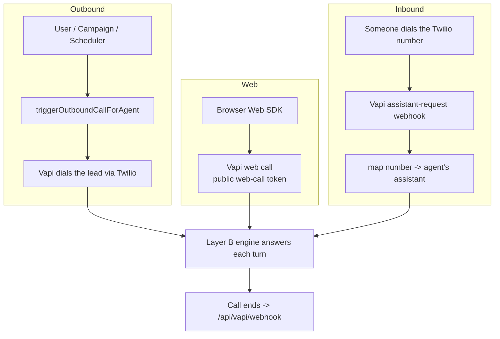
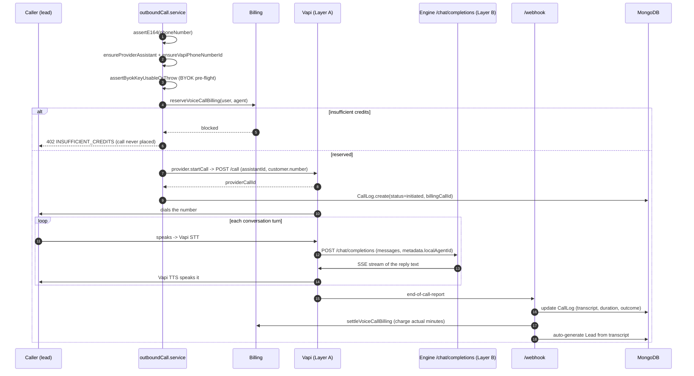
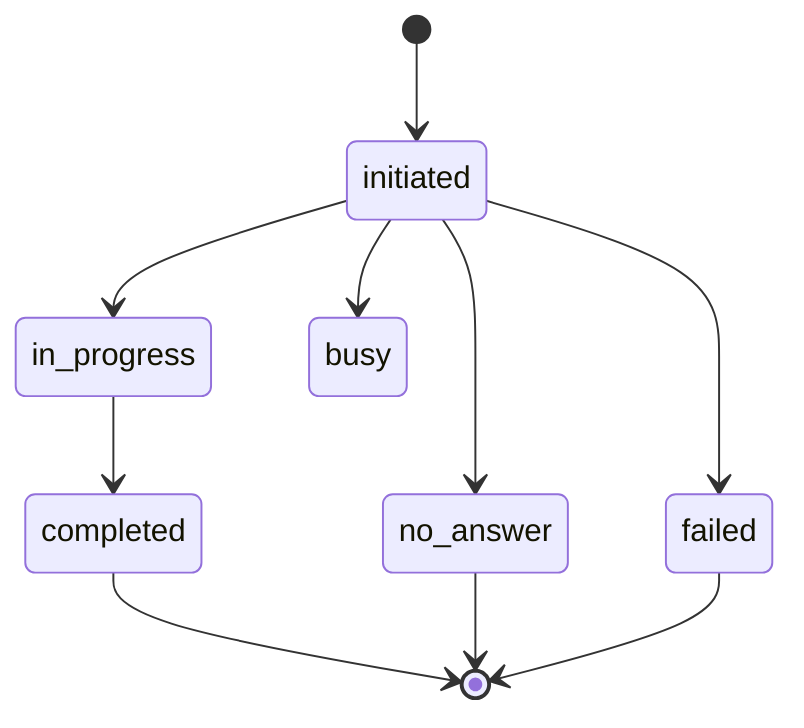

# 04 — Voice Calls

[← Back to index](README.md)

The product's core: an AI agent holding a live phone or web conversation. There are three ways a call starts — **outbound**, **web**, **inbound** — but they all converge on the same two-layer engine.

---

## Files

| File | Role |
|------|------|
| `backend/src/services/outboundCall.service.js` | `triggerOutboundCallForAgent` — the outbound entry point |
| `backend/src/providers/index.js` + provider impls | `provider.startCall(agent, …)` abstraction (Vapi is live) |
| `backend/src/services/vapi.service.js` | `createOutboundCall`, phone-number import, assistant CRUD |
| `backend/src/controllers/vapiChat.controller.js` | `/chat/completions` streaming engine (Layer B) |
| `backend/src/controllers/vapiWebhook.controller.js` | `/webhook` end-of-call / status |
| `backend/src/services/billing/voiceCallBilling.service.js` | reserve → settle credits |
| `backend/src/models/CallLog.js` | Call record |

---

## The three call types

---

## Outbound call — end to end

This is the most important flow. Triggered by a user click, a campaign, a scheduled call, or a follow-up.

### Step-by-step (from `triggerOutboundCallForAgent`)

1. **Validate** the destination number is E.164.
2. **Self-heal**: if the agent has no Vapi assistant yet, create it; if it has no Vapi phone-number id, import its Twilio number into Vapi (`ensureVapiPhoneNumberId`).
3. **BYOK pre-flight** (`assertByokKeyUsableOrThrow`): if the agent uses its own LLM key and it's missing/invalid, **throw before reserving credits** — no silent fallback, no wasted credits.
4. **Reserve credits** (`reserveVoiceCallBilling`). If the balance can't cover the minimum, return **402** and never place the call.
5. **Place the call** through the provider (`provider.startCall` → Vapi `POST /call`). On failure, **release** the reserved credits.
6. **Create the `CallLog`** with `status: "initiated"` and the `billingCallId`, so the webhook can match it later.

The `metadata` sent to Vapi carries `localAgentId`, `userId`, `leadId`, `campaignId`, `campaignRecipientId` — these thread the call back to the right records when the webhook fires.

---

## Web call

A browser test/talk experience using Vapi's Web SDK. Public pages fetch a **web-call token** (`/api/public/agents/:slug/web-call-token`) and config, then the Web SDK connects directly to Vapi. There's no Twilio leg — but the same Layer B engine answers each turn. Enabling/disabling per agent: `POST/GET/DELETE /api/agents/:agentId/web-call`.

---

## Inbound call

When someone dials the agent's Twilio number, Vapi asks our server which assistant to use via the **`assistant-request`** webhook. We map the dialed `vapiPhoneNumberId` → the owning agent and return its `providerAgentId`. See [05](05-vapi-webhooks.md) and [12 — Telephony](12-telephony.md).

---

## Call states & the CallLog

`CallLog` records everything. `status` moves roughly:

`applyCallOutcomeToLog` maps provider statuses to our canonical outcome and decides billability. Manual controls exist: `POST /api/calls/:id/sync` (pull latest from Vapi), `/:id/retry`, `/:id/extract-lead`, `GET /:id/recording`.

---

## Billing hooks (summary)

- **Reserve** happens *before* the call (in `outboundCall.service`).
- **Settle** happens *after* the call, in the `end-of-call-report` webhook, against the real duration.
- Reservation is **released** if the call never starts.

Full detail: **[10 — Billing & Credits](10-billing-credits.md)**.

---

## Related

- What actually answers each turn → **[05 — Vapi Webhooks & Engine](05-vapi-webhooks.md)**
- Bulk calling → **[08 — Campaigns](08-campaigns.md)**
- Retries & scheduling → **[09 — Follow-ups & Scheduled Calls](09-followups-scheduled.md)**
- Leads created from calls → **[06 — Leads](06-leads.md)**
