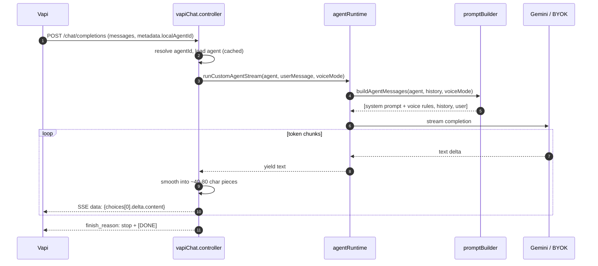
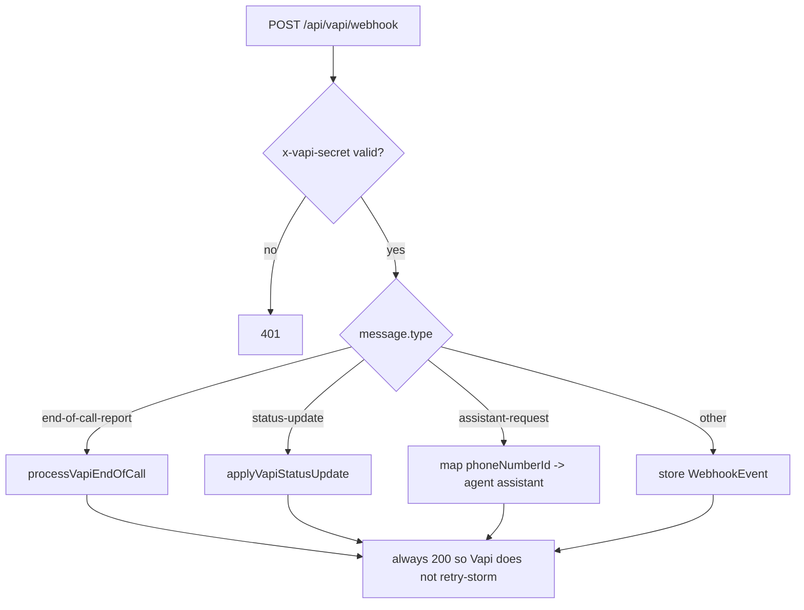
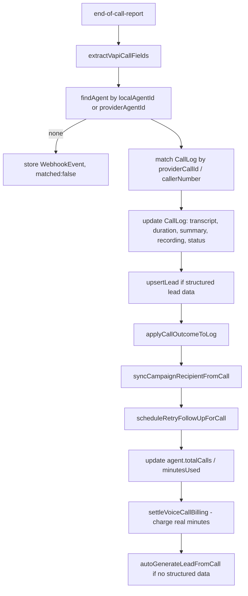

# 05 — Vapi Webhooks & the Conversation Engine (Layer B)

[← Back to index](README.md)

This is the heart of the platform. Two routes under `/api/vapi` make our backend the brain of every call:

| Route | What it is |
|-------|-----------|
| `POST /api/vapi/chat/completions` | The **custom-LLM engine**. Vapi calls it on every turn; we stream back the reply. |
| `POST /api/vapi/webhook` | Vapi **server events** — end-of-call report, status updates, inbound routing. |

Both are exempt from rate limiting and must never be blocked or buffered.

---

## Files

| File | Role |
|------|------|
| `backend/src/routes/vapi.routes.js` | Mounts both routes |
| `backend/src/controllers/vapiChat.controller.js` | Streaming engine + SSE smoothing |
| `backend/src/engine/agentRuntime.js` | `runCustomAgentStream` — history + LLM streaming |
| `backend/src/engine/promptBuilder.js` | Builds the system prompt for each turn |
| `backend/src/llm/gemini.llm.js` (+ providers) | Low-level LLM streaming |
| `backend/src/controllers/vapiWebhook.controller.js` | Server-event handling |
| `backend/src/services/leadGeneration.service.js` | Auto-generate a lead from a call |
| `backend/src/services/billing/voiceCallBilling.service.js` | Settle billing |

---

## Part 1 — `/chat/completions` (the engine)

Vapi's assistant is configured as `model.provider = custom-llm` pointing at this URL. On each caller turn, Vapi sends an OpenAI-style chat-completion request; we respond with an **OpenAI-compatible SSE stream** of the reply.

### Why it's built this way

- **SSE streaming, not a single JSON body.** Speech must start fast, so we stream partial text as it's generated.
- **`createVoiceChunkBuffer` (smoothing).** Raw LLM tokens are choppy; the controller re-chunks them into natural ~40–80 char pieces on word/punctuation boundaries so TTS sounds smooth and starts quickly.
- **Never returns 500 to Vapi.** A 500 makes Vapi drop the call, so on any engine error it streams a safe fallback sentence (`"Sorry, I had a little trouble…"`) instead.
- **Latency instrumentation.** The controller logs `request_received → agent_loaded → llm_started → first_llm_token → first_sse_flush → stream_done` so slow turns are diagnosable.
- **Agent cache.** Agents are cached briefly (`AGENT_CACHE_FOUND_TTL_MS`) to avoid a DB read on every turn.

### The prompt (`promptBuilder.js`)

`buildAgentMessages` composes the system message from `agent.systemPrompt`, optional `firstMessage` guidance, and — in voice mode — a compact **live-voice behaviour block** (short replies, one question at a time, natural speech). Voice prompts are **capped at ~6000 chars** and truncated with a warning to protect time-to-first-token.

> Historical note: a human warm-transfer feature once added a `<<TRANSFER>>` sentinel + gate here. It was **fully removed** because a text-only custom LLM (Gemini 2.5 Flash) couldn't emit the token reliably. The engine now streams plain text only.

---

## Part 2 — `/webhook` (server events)

Vapi POSTs server messages here. The controller verifies the shared secret, then switches on `message.type`.

### `end-of-call-report` — the important one

This single handler finalizes the whole call:

Everything downstream of a call hangs off this handler: **billing settlement, lead creation, campaign progress, and retry scheduling all happen here.**

### The `deps` resolver pattern (important gotcha)

Express calls the handler as `vapiWebhook(req, res, next)`, so the third positional arg `deps` is actually Express's `next`, **not** the intended default deps object. Every model/function is therefore resolved defensively:

- `resolveModel(deps, "Agent")` → injected dep, else `mongoose.model("Agent")`.
- `resolveFn(deps, "settleVoiceCallBilling", moduleImport)` → injected dep, else the module import, else a no-op.

This is a real fix: without it, `deps.WebhookEvent.create(...)` and `deps.applyCallOutcomeToLog(...)` throw `TypeError` and silently kill billing + lead creation on every call. Tests inject real `deps`, which is why `deps` takes priority.

### `assistant-request` (inbound routing)

For inbound calls, we map the dialed `vapiPhoneNumberId` → the owning agent and return `{ assistantId: agent.providerAgentId }`, or `{}` to let Vapi use whatever is statically attached.

---

## Security

- The webhook verifies `x-vapi-secret` against `VAPI_WEBHOOK_SECRET` (constant-time compare). In production, an unset secret **rejects** all webhooks (fail-closed) because these events trigger billing and lead creation.
- The webhook **always returns 200** (even on internal error) so Vapi doesn't hammer retries; failures are logged with detail.

---

## Related

- The call that leads here → **[04 — Voice Calls](04-voice-calls.md)**
- Money side → **[10 — Billing & Credits](10-billing-credits.md)**
- Leads produced → **[06 — Leads](06-leads.md)**
