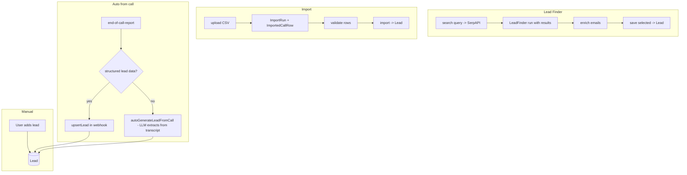
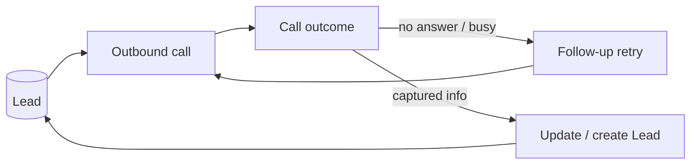

# 06 — Leads

[← Back to index](README.md)

A **lead** is a contact the platform can call/email. Leads come in three ways: added manually, discovered via **Lead Finder**, imported from a file, or **auto-generated from a completed call**.

---

## Files

| File | Role |
|------|------|
| `backend/src/routes/lead.routes.js` | Lead CRUD, CSV export, call-again |
| `backend/src/controllers/lead.controller.js` | Lead handling |
| `backend/src/models/Lead.js` | Lead schema |
| `backend/src/services/leadGeneration.service.js` | `autoGenerateLeadFromCall` (transcript → lead) |
| `backend/src/routes/leadFinder.routes.js` + `models/LeadFinder.js` | Lead discovery (SerpAPI) |
| `backend/src/routes/importCalls.routes.js` + `models/ImportRun.js`, `ImportedCallRow.js` | Bulk import |

---

## Endpoints

| Method | Path | Purpose |
|--------|------|---------|
| GET | `/api/leads` | List / filter / search |
| GET | `/api/leads/export/csv` | Export CSV |
| GET/PUT/DELETE | `/api/leads/:id` | Read / update / delete |
| POST | `/api/leads/:id/call-again` | Place another call to this lead |

Lead Finder (`/api/lead-finder`): `providers`, `search`, `enrich-emails`, `runs`, `runs/:id`, `runs/:id/save`, `leads/import`.

---

## How leads are created

### Auto-generation from calls (the clever part)

When a call ends without structured lead fields, `autoGenerateLeadFromCall` runs the transcript through the LLM to extract name / phone / requirement / budget / etc., and creates a `Lead` linked to that `CallLog`. This is called from **three places** that must stay in sync: the live webhook, the manual call-sync, and the status backfill — all route through `leadGeneration.service`.

---

## Lead → call loop

A lead can trigger a call (`/:id/call-again`), that call produces or updates a lead, and the outcome can schedule a retry follow-up. This is the growth loop:

See [09 — Follow-ups](09-followups-scheduled.md) for the retry side.

---

## Related

- Bulk calling leads → **[08 — Campaigns](08-campaigns.md)**
- Where auto-gen is invoked → **[05 — Vapi Webhooks](05-vapi-webhooks.md)**
