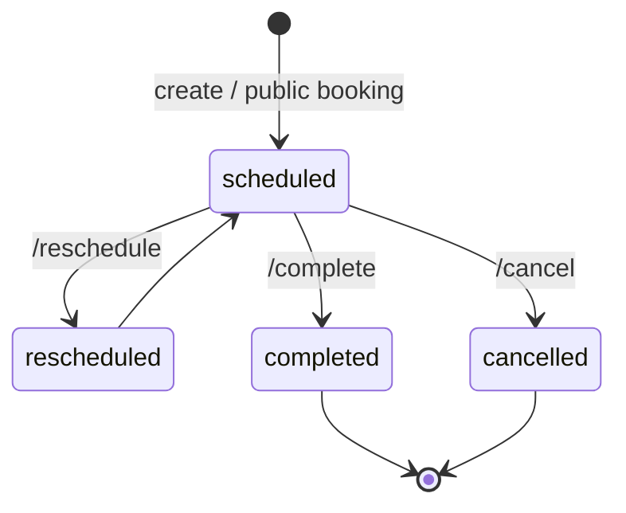
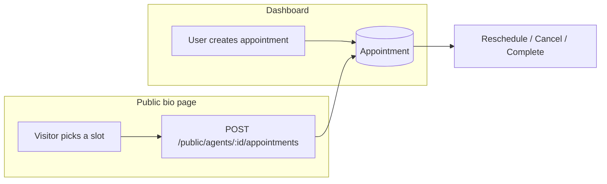

# 07 — Appointments

[← Back to index](README.md)

Bookings created either from the dashboard or from a **public agent bio page** (a visitor books a slot). Supports reschedule, cancel, and complete.

---

## Files

| File | Role |
|------|------|
| `backend/src/routes/appointment.routes.js` | Appointment endpoints |
| `backend/src/controllers/appointment.controller.js` | Handling |
| `backend/src/models/Appointment.js` | Schema |
| `backend/src/routes/public.routes.js` | `POST /api/public/agents/:agentId/appointments` (public booking) |

---

## Endpoints (`/api/appointments`, `protect`ed)

| Method | Path | Purpose |
|--------|------|---------|
| GET | `/` | List |
| POST | `/` | Create |
| GET | `/:id` | Read |
| PATCH | `/:id` | Update |
| DELETE | `/:id` | Delete |
| POST | `/:id/reschedule` | Move to a new time |
| POST | `/:id/cancel` | Cancel |
| POST | `/:id/complete` | Mark done |

Public: `POST /api/public/agents/:agentId/appointments` — no auth, a visitor books from the bio page.

---

## Lifecycle

## Booking sources

Appointments are owned by a user and linked to an agent (and often a lead). Admins can view/manage all appointments via `/api/admin/appointments`.

---

## Related

- Public booking surface → **[15 — Bio Pages & Public Agent](15-bio-pages-public.md)**
- The lead being booked → **[06 — Leads](06-leads.md)**
