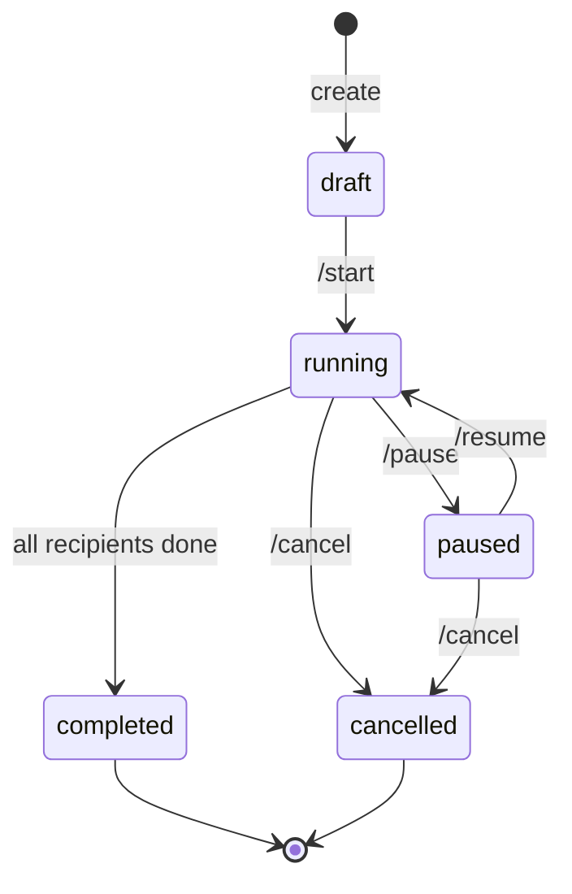
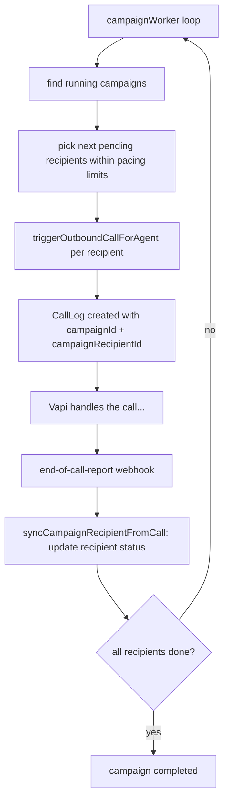

# 08 — Campaigns (Voice)

[← Back to index](README.md)

A **campaign** places outbound calls to many recipients with one agent, paced by a background worker. (Email campaigns are separate — see [11 — Email](11-email.md).)

---

## Files

| File | Role |
|------|------|
| `backend/src/routes/campaign.routes.js` | Campaign endpoints |
| `backend/src/controllers/campaign.controller.js` | CRUD, start/pause/resume/cancel |
| `backend/src/services/campaign.service.js` | Recipient sync from call outcomes |
| `backend/src/services/campaignWorker.js` | Background pacing loop (`RUN_WORKERS=true`) |
| `backend/src/models/Campaign.js`, `CampaignRecipient.js` | Schemas |

---

## Endpoints (`/api/campaigns`, `protect`ed)

| Method | Path | Purpose |
|--------|------|---------|
| GET/POST | `/` | List / create |
| GET | `/lead-options` | Selectable leads |
| GET/PATCH/DELETE | `/:id` | Read / update / delete |
| POST | `/:id/add-leads` | Add leads as recipients |
| POST | `/:id/import-recipients` | Import recipients (raw upload) |
| POST | `/:id/start` `/pause` `/resume` `/cancel` | Lifecycle control |
| GET | `/:id/recipients` `/stats` | Progress |
| POST | `/:id/retry-failed` | Requeue failed recipients |

---

## Lifecycle

## How the worker runs a campaign

Key points:
- The worker only runs on the **background-worker instance** (`RUN_WORKERS=true`); the web instance never paces campaigns.
- Each call carries `campaignId` + `campaignRecipientId` in its metadata, so when the **end-of-call-report** fires, `syncCampaignRecipientFromCall` updates that recipient's status and the campaign's progress counts.
- Every campaign call still goes through the normal **credit reserve → settle** path ([10](10-billing-credits.md)); a campaign can't bypass billing.
- `retry-failed` requeues recipients whose calls failed/no-answered.

---

## Related

- The per-call flow → **[04 — Voice Calls](04-voice-calls.md)**
- Recipient status update trigger → **[05 — Vapi Webhooks](05-vapi-webhooks.md)**
