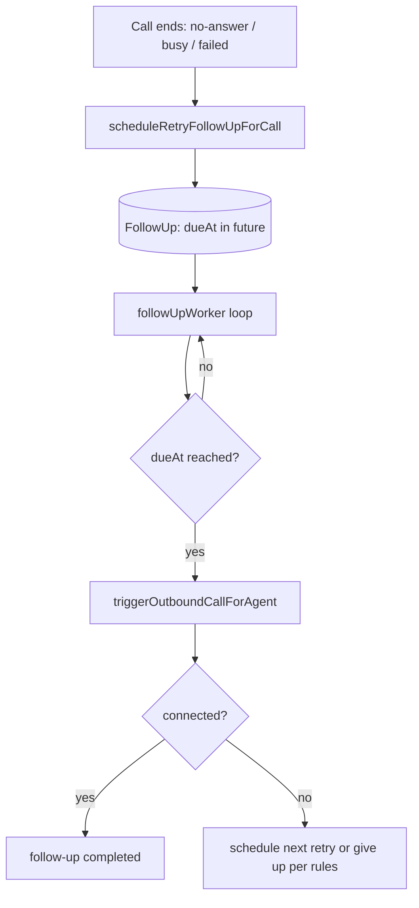
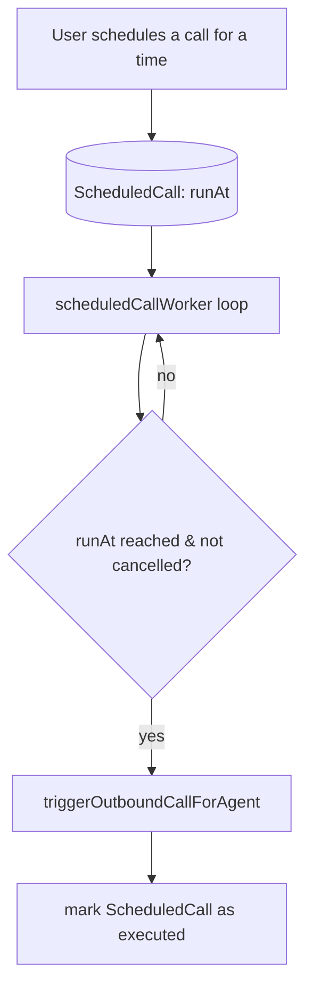
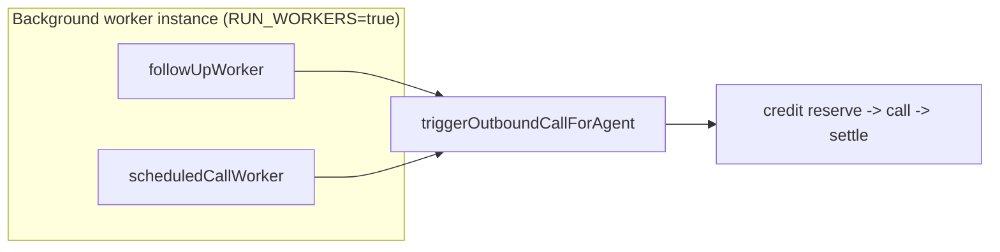

# 09 — Follow-ups & Scheduled Calls

[← Back to index](README.md)

Two time-based systems that place calls later:
- **Follow-ups** — automatic retries after a call didn't connect (or a manual reminder to call again).
- **Scheduled calls** — a call queued to run at a specific future time.

Both are driven by **background workers** and both ultimately call `triggerOutboundCallForAgent`.

---

## Files

| System | Files |
|--------|-------|
| Follow-ups | `routes/followUp.routes.js`, `controllers/followUp.controller.js`, `services/followUpWorker.js`, `services/callOutcome.service.js`, `models/FollowUp.js` |
| Scheduled calls | `routes/scheduledCall.routes.js`, `controllers/scheduledCall.controller.js`, `services/scheduledCallWorker.js`, `models/ScheduledCall.js` |

---

## Follow-ups

### Endpoints (`/api/followups`)

`GET /`, `POST /`, `GET/PATCH/DELETE /:id`, `POST /:id/run` (run now), `POST /:id/reschedule`, `POST /:id/cancel`.

### How a follow-up is created & runs

Follow-ups are created automatically from the **end-of-call-report** webhook (`scheduleRetryFollowUpForCall`) when a call didn't connect, and can also be created/edited manually.

---

## Scheduled calls

### Endpoints (`/api/scheduled-calls`)

`POST /` (schedule), `GET /` (list), `GET /agent/:agentId`, `PATCH /:id/cancel`.

### How a scheduled call runs

---

## Where these run

Both workers are started in `server.js` only when `RUN_WORKERS=true`. Neither bypasses billing — each placed call reserves and settles credits like any other outbound call ([10](10-billing-credits.md)).

---

## Related

- The call they place → **[04 — Voice Calls](04-voice-calls.md)**
- What schedules the retry → **[05 — Vapi Webhooks](05-vapi-webhooks.md)**
