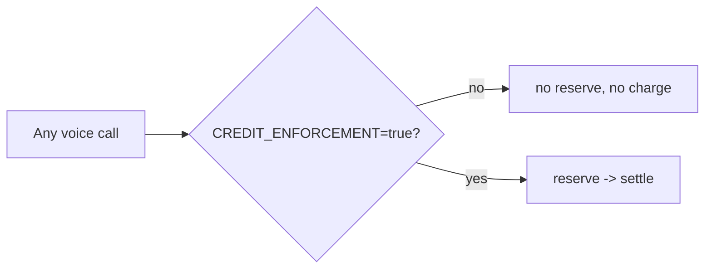
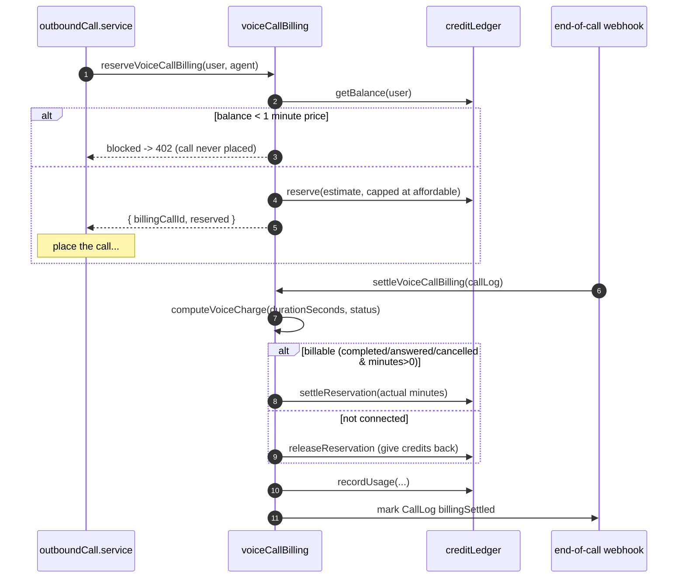
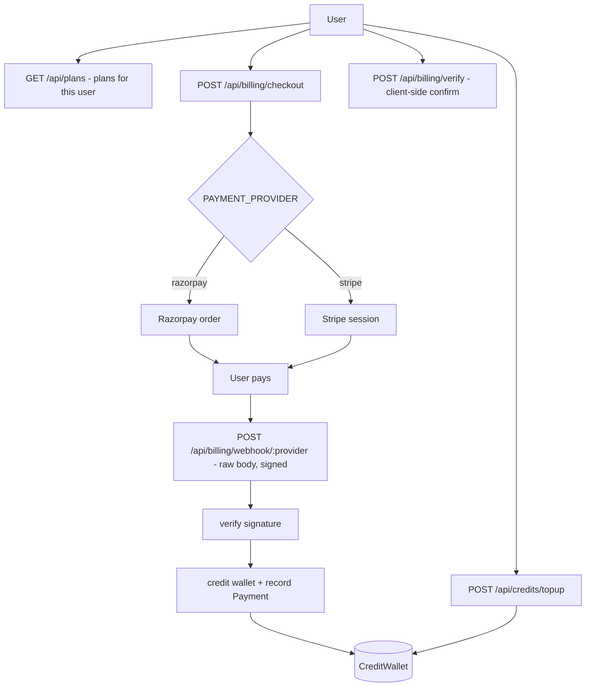

# 10 — Billing & Credits

[← Back to index](README.md)

Every voice call spends **platform credits** from a per-user wallet. Credits are bought via plans/top-ups (Razorpay or Stripe). The billing model is **reserve before the call → settle after**, all idempotent.

---

## Files

| File | Role |
|------|------|
| `backend/src/services/billing/voiceCallBilling.service.js` | `reserve` / `release` / `settle` for voice calls |
| `backend/src/services/billing/creditLedger.service.js` | Low-level ledger: balance, reserve, settle, charge, usage |
| `backend/src/config/creditPricing.js` | Per-action pricing (`getActionPricing`) |
| `backend/src/config/plans.js` | Plan config in memory |
| `backend/src/routes/billing.routes.js` + `billing.controller.js` | Checkout / verify / webhook |
| `backend/src/routes/credits.routes.js` | Balance + top-up |
| `backend/src/routes/plans.routes.js` | Plans available to a user |
| `backend/src/models/` | `CreditWallet`, `CreditTransaction`, `Plan`, `UserPlan`, `PlanConfig`, `PlanChangeLog`, `Payment`, `UsageLog` |

---

## The master switch

Billing only runs when `CREDIT_ENFORCEMENT=true`. Otherwise every billing call is a **no-op** (`enforced: false`) and calls are free — useful for local dev.

---

## Reserve → Settle (the core model)

### Reserve (`computeReservation`)
- Reserves `CALL_ESTIMATED_MINUTES` (default 5) worth of credits, **capped at what the balance can afford**.
- **Blocks the call** if the balance can't cover even **one minute** → caller sees `402 INSUFFICIENT_CREDITS`.
- If the call fails to even start, the reservation is **released** (`releaseVoiceReservation`).

### Settle (`computeVoiceCharge`)
- Rounds actual talk time **up to whole minutes** (`ceil(seconds/60)`).
- **Billable only** for `completed` / `answered` / `cancelled` with real minutes. `no_answer` / `busy` / `failed` / `declined` → reservation **released**, nothing charged.
- **Idempotent**: keyed by `billingCallId`; safe to call from the live webhook, manual sync, or backfill without double-charging. Sets `callLog.billingSettled = true`.

> This settle path was once silently broken (a `ReferenceError` swallowed by a caller's `try/catch`), which is why it now guards inputs carefully and records usage explicitly.

---

## Billing modes

| Mode | When | Charged |
|------|------|---------|
| `platform_credits` | **Always for voice** (calls run on the platform Vapi account) | reservation settled against real minutes |
| `byok` | retained for non-voice meters | a small per-minute platform fee at settle |

Note: even a **BYOK LLM** agent's *voice* is billed as `platform_credits`, because voice always runs on the platform's Vapi account. BYOK only changes which **LLM key** answers the turn ([13](13-integrations.md)).

---

## Buying credits (plans, top-ups, payments)

- Payment webhooks are mounted **before `express.json`** (`app.js`) so the raw body is available for **signature verification** — never trust an unsigned credit grant.
- `PAYMENT_PROVIDER` selects Razorpay (default) or Stripe; each has its own key + webhook secret.
- Plan config (`PlanConfig`, `config/plans.js`) and credit pricing (`config/creditPricing.js`) are refreshed into memory at startup and are admin-editable ([16](16-admin.md)).

---

## Reading balance

`GET /api/credits` returns the current wallet balance and recent transactions. The ledger (`creditLedger.service`) is the single source of truth for balance, reservations, charges, and `UsageLog`.

---

## Related

- Where reserve/settle are called → **[04 — Voice Calls](04-voice-calls.md)** & **[05 — Vapi Webhooks](05-vapi-webhooks.md)**
- Admin credit grants & plan config → **[16 — Admin](16-admin.md)**
