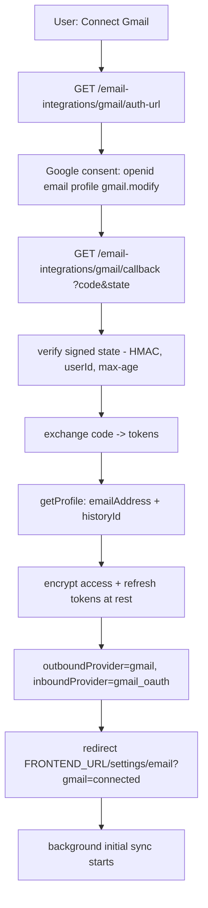
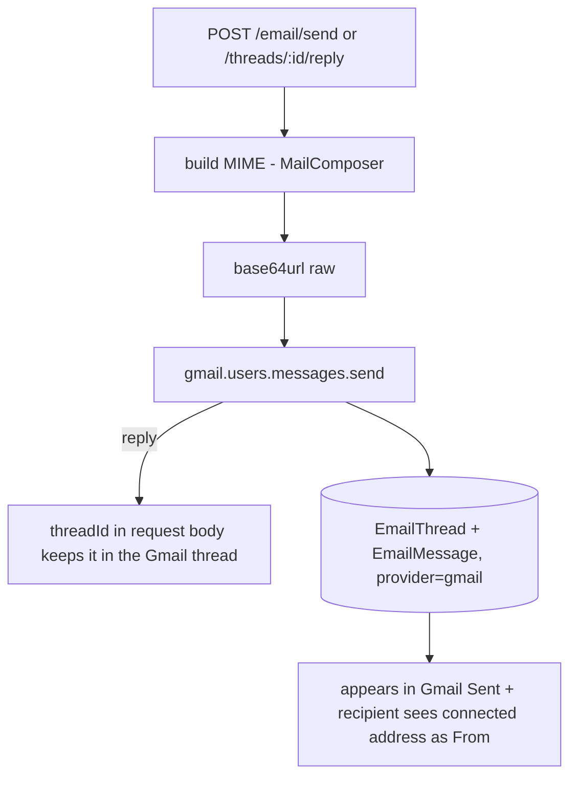
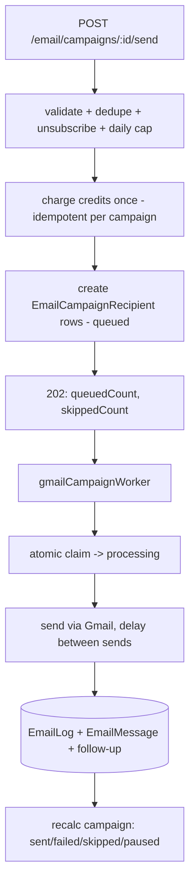

# 11 — Email (Gmail)

[← Back to index](README.md)

Full two-way email through the user's **own Gmail account**, connected via Google OAuth. Users read their inbox/sent/drafts/etc., open threads, compose, reply / reply-all (kept inside the original Gmail thread), search, load older mail, and run personalized bulk campaigns — all sent from their real Gmail address.

> Legacy **Brevo** (outbound) and **IMAP** (inbound) code is preserved in the backend for rollback but hidden from the UI. Once Gmail is connected it is the only send/receive path.

---

## Files

| File | Role |
|------|------|
| `backend/src/services/gmail/gmailOAuth.service.js` | OAuth client, signed state, token exchange/refresh, revoke |
| `backend/src/services/gmail/gmailParser.service.js` | Parse `messages.get` payloads (bodies, headers, attachments, direction) |
| `backend/src/services/gmail/gmailMime.service.js` | Build RFC MIME via MailComposer → base64url (no SMTP) |
| `backend/src/services/gmail/gmailSend.service.js` | `messages.send`, fetch attachment bytes |
| `backend/src/services/gmail/gmailSync.service.js` | Initial + incremental sync, import-more, search |
| `backend/src/services/gmail/gmailLabels.service.js` | Mark read / star / trash via label modify |
| `backend/src/services/gmail/gmailStore.service.js` | Persist a sent message into `EmailThread` + `EmailMessage` |
| `backend/src/services/gmail/gmailReply.util.js` | Reply / Reply-All recipient + threading-header builders |
| `backend/src/services/gmail/gmailErrors.js` | Classify Google errors (auth / rate-limit / temporary / permanent) |
| `backend/src/services/emailInboundSyncService.js` | Provider router: Gmail → Gmail sync, else legacy IMAP |
| `backend/src/workers/gmailCampaignWorker.js` | Background campaign send queue (`RUN_WORKERS=true`) |
| `backend/src/models/` | `EmailIntegration`, `EmailThread`, `EmailMessage`, `EmailCampaign`, `EmailCampaignRecipient`, `EmailLog` |

---

## Connect flow (separate from Google login)

Application login (`/api/auth/google`) and Gmail authorization are **two distinct OAuth flows** that share one Google client but use different callback URLs.

- **Login is never modified.** `/api/auth/google` still requests only `profile email`.
- The callback is **public** (Google calls it without the app JWT); authorization relies on the **signed state** (`signGmailState`/`verifyGmailState`).
- Tokens are encrypted with `credentialEncryptionService` (AES-256-GCM). They are **never** logged or returned to the browser. On reconnect where Google omits a new refresh token, the stored one is preserved.

---

## Sync (initial + incremental)

`emailInboundSyncService.syncEmailIntegration` routes Gmail integrations to `runGmailSync`.

- **Initial (first connection):** `messages.list` with `GMAIL_INITIAL_SYNC_QUERY` (default `newer_than:90d -in:chats`), up to `GMAIL_INITIAL_SYNC_MAX_MESSAGES` (500), paginated at `GMAIL_SYNC_PAGE_SIZE` (100), fetched with bounded concurrency. The `nextPageToken` is saved for **Load Older Emails**.
- **Incremental:** `history.list` from the stored `gmailHistoryId` processes `messagesAdded`, `labelsAdded`, `labelsRemoved`, and deletions, then advances the cursor.
- **History expired (HTTP 404):** the cursor is reset and a controlled full sync runs, then a fresh `historyId` is adopted — never a permanent failure.
- A per-integration lock prevents concurrent syncs. Realtime events (`email:received`, `email:unread-count`, `email:sync-status`) continue to fire.

Older mail is available on demand via **`POST /email-integrations/gmail/import-more`** (uses the saved `nextPageToken`) — the mailbox is never imported in one blocking request.

---

## Compose, reply & threading

- **From** is always the connected Gmail address.
- **Replies** pass the Gmail `threadId` plus `In-Reply-To` / `References` headers so they stay in the same conversation everywhere. Threading resolves by Gmail `providerThreadId` first, then Message-ID chain, then lead relation, then (last) subject.
- **Reply All** includes the original To/Cc, excludes the connected address, dedupes, and never copies Bcc.
- Attachments: outgoing via multipart MIME (size-capped by `GMAIL_MAX_ATTACHMENT_MB`); download via `GET /email/messages/:messageId/attachments/:attachmentId` (ownership-checked, `users.messages.attachments.get`).

---

## Campaign queue (background)

Enqueue is instant; sending is paced by a worker — no long-held HTTP request, one personalized message per recipient (never a BCC blast).

- Recipient uniqueness `(campaignId, toEmail)` makes enqueue **idempotent**; credits charged once (`idempotencyKey = email_campaign:<id>`).
- Worker (`GMAIL_CAMPAIGN_WORKER_ENABLED`, needs `RUN_WORKERS=true`) claims rows atomically (status flip to `processing`), sends at low concurrency with `GMAIL_SEND_DELAY_MS` spacing.
- **Retries:** temporary/rate-limit/5xx → exponential backoff up to `GMAIL_SEND_MAX_RETRIES`. Permanent (invalid recipient, malformed) → fail. `invalid_grant`/auth → pause remaining recipients + flag integration for reconnect.
- App-level daily caps (`gmailDailyLimit`, overridable via `GMAIL_DAILY_LIMITS`) reschedule to the next day rather than failing.
- Frontend polls `GET /email/campaigns/:id/status` for the live breakdown.

---

## Folders, search, state

- `GET /email/threads?folder=inbox|sent|drafts|unread|starred|important|spam|trash|all&search=&page=&limit=` — folder filters are driven by accurate per-message Gmail labels; ownership is always enforced.
- `GET /email/gmail/search?q=` — queries Gmail directly (`from:`, `is:unread`, `has:attachment`, `after:`, `subject:` …), caches matches locally, returns normalized threads.
- Mark read (`POST /email/threads/:id/read`) removes the `UNREAD` label in Gmail (`threads.modify`) as well as updating Mongo. Star/trash/untrash helpers exist in `gmailLabels.service`.

---

## Security

Signed OAuth state · tokens encrypted at rest · no token logging · no tokens to the frontend · ownership checks on every thread/message/attachment · recipient + header-injection validation · sandboxed-iframe HTML rendering (no scripts) · attachment size limits · send rate limits · per-user daily caps · idempotent campaign enqueue.

---

## Related

- Connecting providers → **[13 — Integrations](13-integrations.md)**
- Env + Google Cloud setup → **[19 — Setup & Deployment](19-setup-deployment.md)**
- The worker model → **[01 — Architecture](01-architecture.md)**
