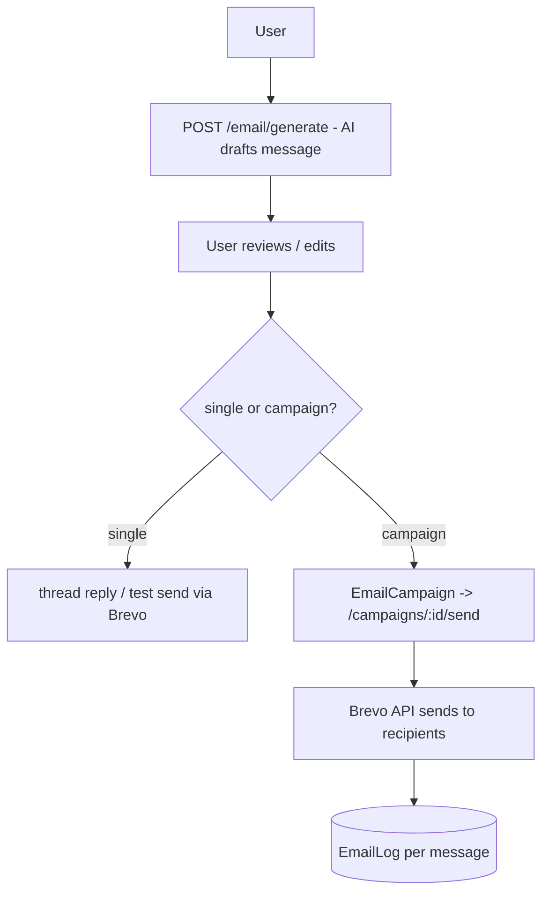
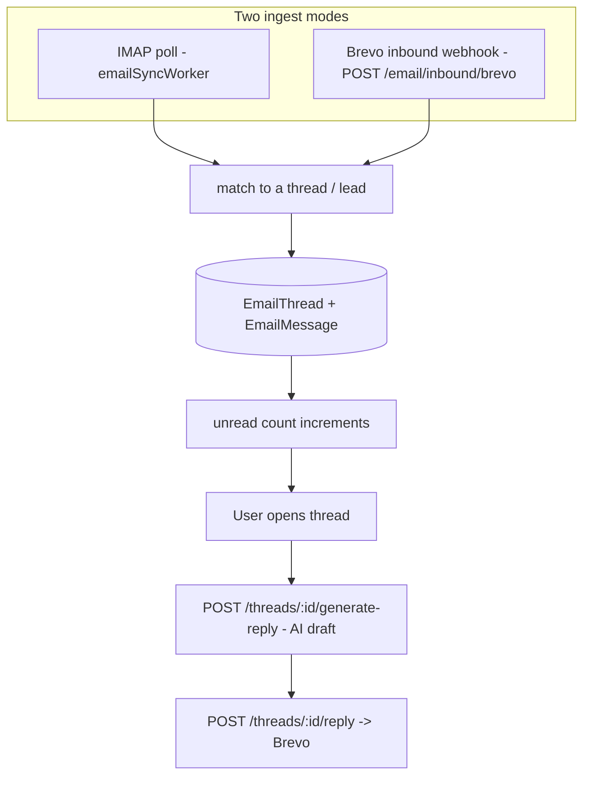

# 11 — Email

[← Back to index](README.md)

Two-way email: **outbound** (AI-generated messages + campaigns, sent via Brevo) and **inbound** (replies pulled via IMAP, threaded, and answerable with an AI-drafted reply).

---

## Files

| File | Role |
|------|------|
| `backend/src/routes/email.routes.js` | Inbox, threads, campaigns, generation |
| `backend/src/routes/emailIntegration.routes.js` | Connect Brevo / IMAP / Gmail |
| `backend/src/controllers/email*.controller.js` | Handling |
| `backend/src/workers/emailSyncWorker.js` | IMAP polling loop (`RUN_WORKERS=true`) |
| `backend/src/models/` | `EmailIntegration`, `EmailThread`, `EmailMessage`, `EmailCampaign`, `EmailLog` |

---

## Endpoints (selected)

**`/api/email`**: `threads`, `threads/:id`, `threads/:id/messages`, `threads/:id/read`, `threads/:id/generate-reply`, `threads/:id/reply`, `unread-count`, `generate`, `test`, `campaigns`, `campaigns/:id/send`, `logs`, `providers`, `inbound/brevo`, `inbound/poll-now`.

**`/api/email-integrations`**: `status`, `brevo/connect|validate|senders|sender`, `imap/connect|test`, `gmail/auth-url|callback`, `sync-now`, and disconnects.

---

## Outbound email

Sending requires a connected **Brevo** integration with a verified sender. `EMAIL_PROVIDER=brevo` and `BREVO_API_KEY` (or a per-user connected key) drive it.

---

## Inbound email

- **IMAP mode** (`EMAIL_INBOUND_MODE=imap`): `emailSyncWorker` polls the mailbox every `IMAP_POLL_INTERVAL_SECONDS` (only on the worker instance). Credentials (`IMAP_USER` / `IMAP_APP_PASSWORD` or a per-user connected IMAP integration) are encrypted at rest.
- **Webhook mode**: Brevo posts inbound mail to `/api/email/inbound/brevo`.
- Incoming mail is matched into `EmailThread`s and stored as `EmailMessage`s; the user can generate an AI reply and send it.

---

## Related

- Connecting providers → **[13 — Integrations](13-integrations.md)**
- The worker model → **[01 — Architecture](01-architecture.md)**
