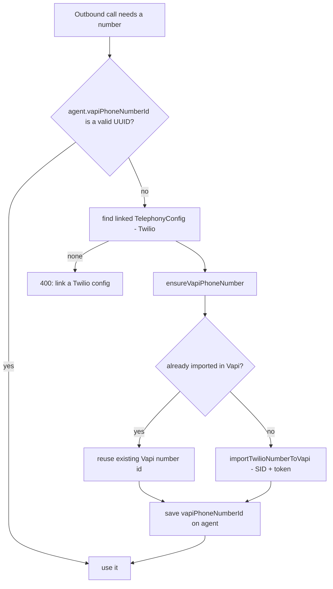

# 12 — Telephony

[← Back to index](README.md)

How real phone numbers connect to the platform. Calls run on **BYO Twilio numbers imported into Vapi**. A `TelephonyConfig` stores a user's Twilio credentials + number; the platform imports that number into Vapi on demand.

---

## Files

| File | Role |
|------|------|
| `backend/src/routes/telephonyConfig.routes.js` | Manage telephony configs (test, configure webhook, verify inbound) |
| `backend/src/routes/telephony.routes.js` | `/:provider/incoming` inbound entry |
| `backend/src/services/vapi.service.js` | `ensureVapiPhoneNumber`, `importTwilioNumberToVapi`, `findVapiPhoneNumberByNumber` |
| `backend/src/services/outboundCall.service.js` | `ensureVapiPhoneNumberId` (auto-provision) |
| `backend/src/models/TelephonyConfig.js` | Twilio creds (encrypted) + number |

---

## Endpoints

| Method | Path | Purpose |
|--------|------|---------|
| POST | `/api/telephony-configs/:id/test` | Validate Twilio creds |
| POST | `/api/telephony-configs/:id/configure-webhook` | Point Twilio at Vapi/us |
| POST | `/api/telephony-configs/:id/verify-inbound-routing` | Check inbound wiring |
| GET/POST | `/api/telephony/:provider/incoming` | Inbound call entry |

---

## Number provisioning (Twilio → Vapi)

The key insight: **we don't dial Twilio directly**. We import the Twilio number into Vapi once (getting a Vapi phone-number UUID), then all calls reference that UUID.

This is **auto-provisioning**: the first call for an agent imports the number; subsequent calls reuse it. Twilio credentials come from the agent's linked `TelephonyConfig` (Account SID + auth token, decrypted from storage), so there's no manual Vapi-dashboard step.

---

## Inbound routing

See the `assistant-request` case in [05 — Vapi Webhooks](05-vapi-webhooks.md).

---

## Security

- Twilio Account SID + auth token are stored encrypted (`utils/secretCrypto.js`) and only decrypted server-side when importing the number.
- `DEFAULT_CALLER_ID_NUMBER` / `DEFAULT_TELEPHONY_PROVIDER` provide fallbacks; `VAPI_PHONE_NUMBER_ID` is an optional env fallback for the outbound number id.

---

## Related

- The call that uses the number → **[04 — Voice Calls](04-voice-calls.md)**
- Vapi assistant sync → **[03 — Agents](03-agents.md)**
