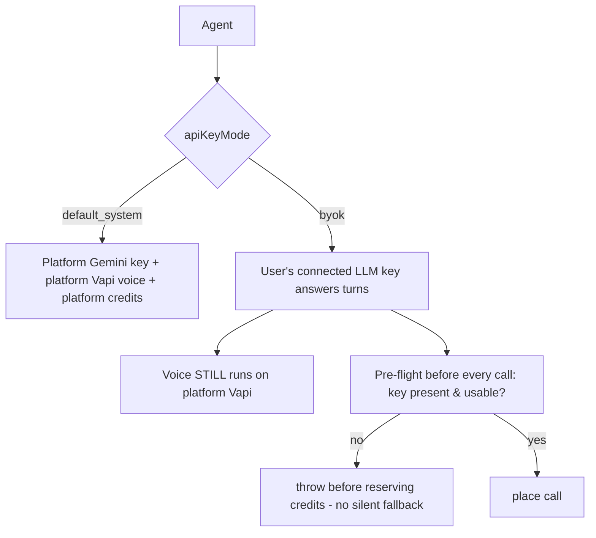
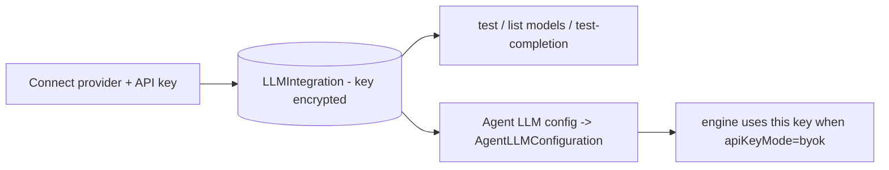
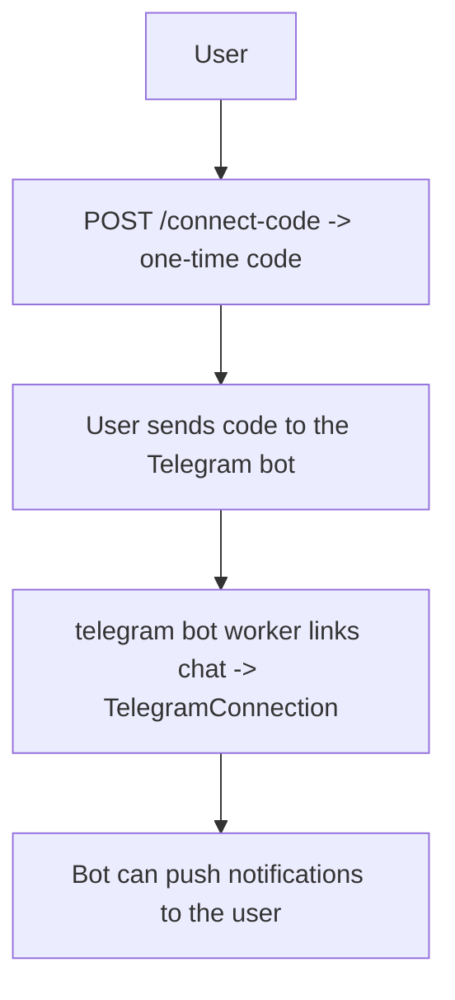

# 13 — Provider Integrations (LLM, Voice, Telegram)

[← Back to index](README.md)

Users can connect their **own** provider accounts (BYOK — bring your own key) instead of the platform defaults. This covers LLM keys, voice keys, and the Telegram bot.

---

## Files

| System | Files |
|--------|-------|
| LLM BYOK | `routes/llmIntegration.routes.js`, `models/LLMIntegration.js`, `models/AgentLLMConfiguration.js`, `services/apiKeyMode.service.js`, `services/agentLLMConfiguration.service.js`, `services/llmProviders/` |
| Voice BYOK | `routes/voiceIntegration.routes.js`, `routes/connections.routes.js`, `models/VoiceIntegration.js`, `models/AgentVoiceConfiguration.js`, `services/agentVoiceConfiguration.service.js` |
| Telegram | `routes/telegramIntegration.routes.js`, `models/TelegramConnection.js`, `services/telegram/bot.js` |

---

## `apiKeyMode`: default vs BYOK

Every agent has an `apiKeyMode` that decides whose keys run the call:

Key rules:
- **Fail-closed default** is `default_system` (platform Gemini + platform Vapi + credits).
- **BYOK switches only the LLM.** Voice always runs on the platform Vapi account (there's no BYOK voice provider after the Vapi migration), so BYOK calls still spend platform credits for voice ([10](10-billing-credits.md)).
- `assertByokKeyUsableOrThrow` runs a **pre-flight** in `outboundCall.service` — if the user's LLM key is missing/invalid, the call throws **before** any credit reservation (no silent fallback to platform keys).

---

## LLM integrations

### Endpoints
`GET /api/integrations/llm`, `POST /:provider/connect`, `POST /:integrationId/test`, `PUT /:integrationId`, `DELETE /:integrationId`, `GET /:integrationId/models`, `POST /:integrationId/test-completion`, plus per-agent config: `GET/PUT /api/agents/:agentId/llm-config`.

Provider identity is normalized in `services/llmProviders/providerIdentity.service.js` (canonical provider names). Keys are encrypted at rest and never returned to the browser.

---

## Voice integrations

### Endpoints
`GET /api/integrations/voice`, `POST /:provider/connect|test`, `DELETE /:provider`, `GET /:provider/voices|models`, `POST /:provider/preview`, plus per-agent: `GET/PUT /api/agents/:agentId/voice-config` and `GET/PATCH /api/connections/voice(/preferences)`.

These let a user browse/preview provider voices and pick a voice per agent (`AgentVoiceConfiguration`). At call time the chosen voice is mapped onto the Vapi assistant (`mapVoice` in `vapi.service.js`).

---

## Telegram

### Endpoints (`/api/integrations/telegram`)
`POST /connect-code`, `GET /status`, `PATCH /settings`, `DELETE /disconnect`.

The Telegram bot runs as a background worker (`startTelegramBot`, only when `RUN_WORKERS=true`). It links a Telegram chat to a user account via a one-time connect code and can deliver notifications.

---

## Related
- Where keys are enforced → **[04 — Voice Calls](04-voice-calls.md)**
- Billing implications of BYOK → **[10 — Billing & Credits](10-billing-credits.md)**
