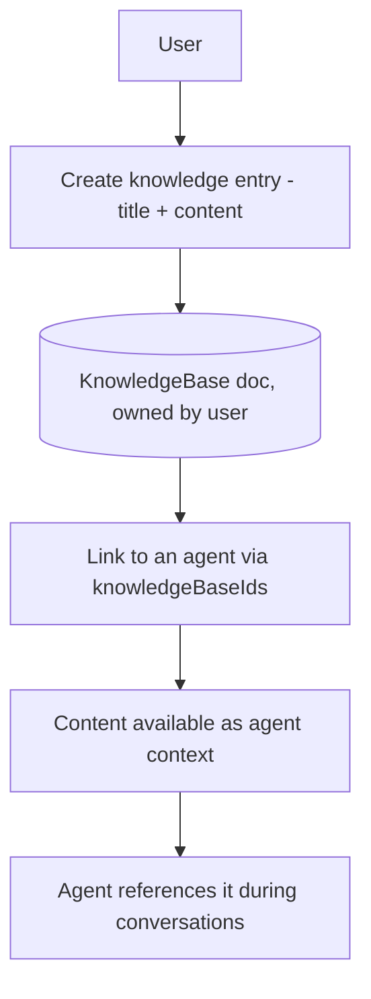

# 14 — Knowledge Base

[← Back to index](README.md)

Knowledge entries give an agent extra domain content to reference. Agents link to knowledge base documents via `Agent.knowledgeBaseIds`.

---

## Files

| File | Role |
|------|------|
| `backend/src/routes/knowledge.routes.js` | Knowledge endpoints (`/api/knowledge`) |
| `backend/src/controllers/knowledge.controller.js` | Handling |
| `backend/src/models/KnowledgeBase.js` | Schema |
| `backend/src/models/Agent.js` | `knowledgeBaseIds: [ObjectId ref KnowledgeBase]` |

---

## Flow

Knowledge documents are user-owned records. Linking them to an agent (`knowledgeBaseIds`) makes the material part of that agent's context so it can answer domain-specific questions during a call or chat.

---

## Related
- How the prompt is built for each turn → **[05 — Vapi Webhooks & Engine](05-vapi-webhooks.md)**
- Agent configuration → **[03 — Agents](03-agents.md)**
