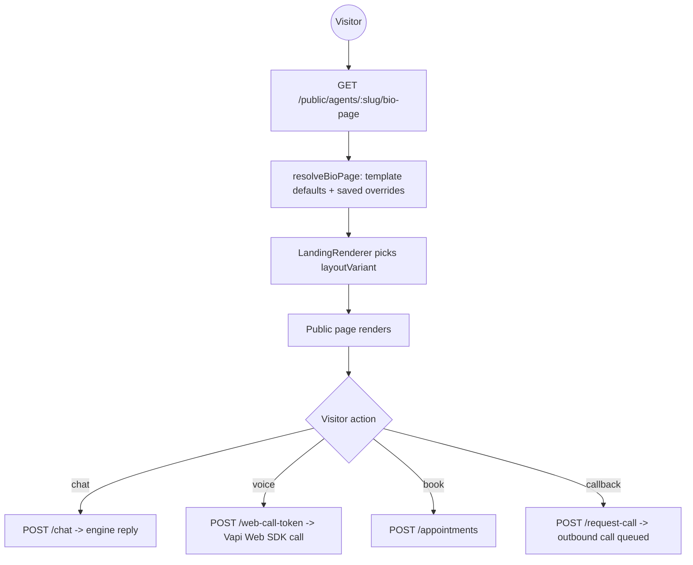

# 15 — Bio Pages & Public Agent

[← Back to index](README.md)

Each agent can have a **public bio page** — a shareable landing page (at a `publicSlug`) where visitors can chat, place a web call, or book an appointment, with no login.

---

## Files

| File | Role |
|------|------|
| `backend/src/routes/public.routes.js` | All unauthenticated public agent endpoints |
| `backend/src/routes/bioPage.routes.js` + agent bio-page routes | Templates + page config |
| `backend/src/services/*bioPage*` / `resolveBioPage` | Merge template defaults + saved config |
| `backend/src/models/Agent.js` (`bioPage` subdoc, `publicSlug`, `isPublic`) | Storage |
| `frontend/src/pages/PublicAgent.jsx`, `BioPageBuilder.jsx` | Render + editor |

---

## Public endpoints (no auth)

| Method | Path | Purpose |
|--------|------|---------|
| GET | `/api/public/agents/:publicSlug` | Public agent info |
| GET | `/api/public/agents/:idOrSlug/bio-page` | Resolved bio-page config |
| POST | `/api/public/agents/:publicSlug/chat` | Text chat with the agent |
| POST | `/api/public/agents/:publicSlug/web-call-token` | Token for a browser voice call |
| GET | `/api/public/agents/:publicSlug/web-call-config` | Web-call settings |
| POST | `/api/public/agents/:agentId/appointments` | Book an appointment |
| POST | `/api/public/agents/:agentId/request-call` | Request a callback |

---

## Owner-side bio-page management (`/api/agents/:id/bio-page/*`)

`GET`/`PATCH`/`PUT` config, `reset`, `publish`, `unpublish`, plus image uploads: `logo`, `cover`, `agent-image`, `topic-icon`, and the agent `avatar`.

---

## Rendering model

Key ideas:
- `resolveBioPage` is the **single merge source**: a template preset provides defaults, the agent's saved `bioPage` overrides them. Old docs that never set a field inherit the template preset (no stale fallback).
- `bioPage.layoutVariant` drives a real layout template (multiple layouts), not just colors.
- **Publish/unpublish** toggles `isPublic`; only published agents render publicly.
- The public **chat** and **web call** use the same Layer B engine as phone calls ([05](05-vapi-webhooks.md)); a **callback request** queues an outbound call ([04](04-voice-calls.md)).

---

## Sharing

`PATCH /api/agents/:agentId/share-settings` controls the shareable link / embed. The `publicSlug` is unique per agent and generated on create.

---

## Related
- The engine behind public chat/voice → **[05 — Vapi Webhooks & Engine](05-vapi-webhooks.md)**
- Booking → **[07 — Appointments](07-appointments.md)**
