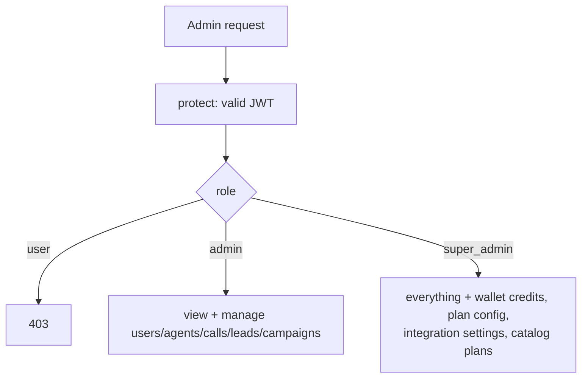
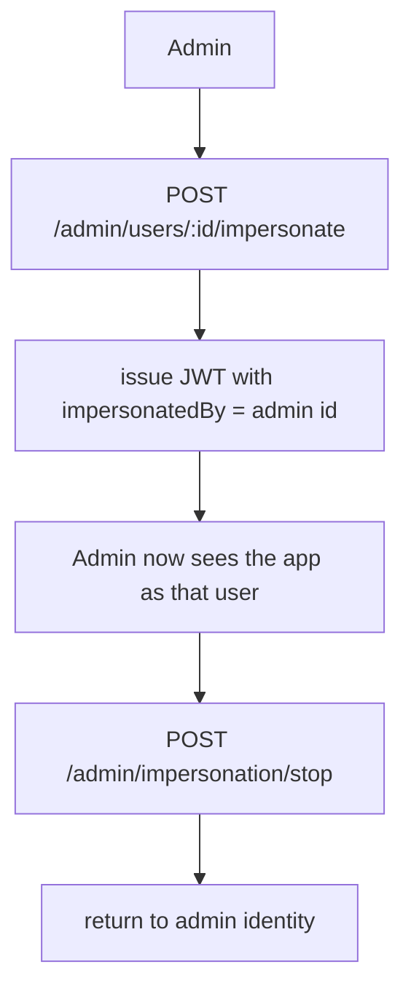

# 16 — Admin Panel

[← Back to index](README.md)

A separate surface (`/api/admin`, guarded by `adminOnly` / `requireSuperAdmin`) for operators to manage users, agents, plans, credits, and to inspect everything across the platform.

---

## Files

| File | Role |
|------|------|
| `backend/src/routes/admin.routes.js` | All admin endpoints |
| `backend/src/controllers/admin*.controller.js` | Handling |
| `backend/src/middleware/auth.middleware.js` | `adminOnly`, `requireSuperAdmin` |
| `backend/src/models/AuditLog.js` | Admin action trail |
| `frontend/src/pages/Admin.jsx` | Admin UI |

---

## Access levels

- `adminOnly` → `admin` or `super_admin`.
- `requireSuperAdmin` → `super_admin` only: wallet credit grants, plan config, integration settings, and the plan **catalog** (create/update/assign plans).

---

## What admins can do

| Area | Endpoints (under `/api/admin`) |
|------|-------------------------------|
| Overview | `overview`, `stats`, `usage`, `audit-logs` |
| Users | `users`, `users/:id`, `suspend`, `activate`, `reset-password`, `delete`, `impersonate` |
| Per-user data | `users/:id/{agents,leads,calls,campaigns,appointments,email-campaigns,followups,usage}` |
| Agents | `agents`, `agents/:id`, `pause`, `activate`, `delete` |
| Calls / Leads | `calls`, `calls/:id`, `leads`, `leads/:id`, `leads/export` |
| Appointments / Follow-ups | list + update/cancel/complete/run |
| Money (super admin) | `users/:id/wallet-credits`, `users/:id/credits`, `users/:id/limits`, `users/:id/plan` |
| Plan catalog (super admin) | `catalog-plans` CRUD, `duplicate`, `archive/restore`, `assign/unassign`, `plan-config` |
| Settings (super admin) | `settings/integrations` |

---

## Impersonation

The impersonation token embeds `impersonatedBy`, which `protect` surfaces as `req.impersonatedBy`. Admin actions are recorded in `AuditLog`.

---

## Related
- Auth guards → **[02 — Authentication](02-authentication.md)**
- Plans & credits → **[10 — Billing & Credits](10-billing-credits.md)**
