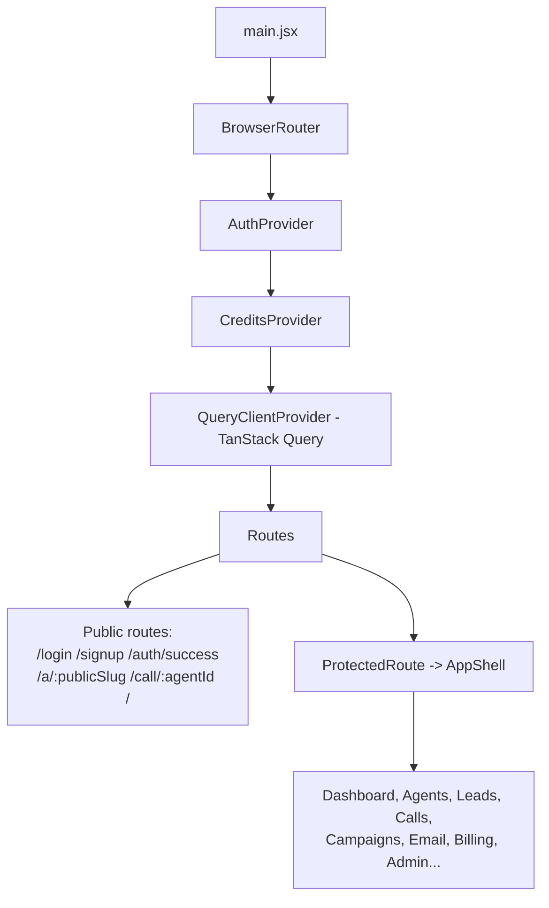
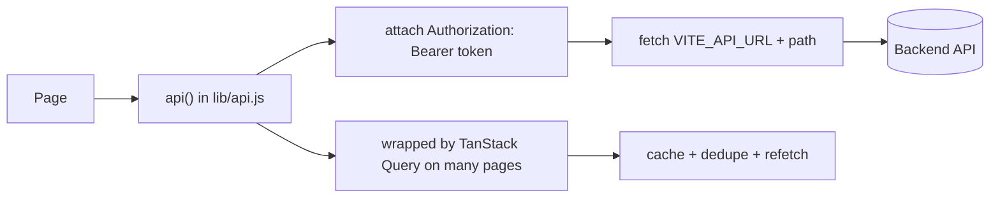

# 17 — Frontend

[← Back to index](README.md)

A React 18 + Vite SPA (Tailwind styling). Routing, auth, and data fetching are set up in `frontend/src/main.jsx`; API calls go through a thin `lib/api.js` wrapper, with TanStack Query for caching.

---

## Structure

```
frontend/src/
├── main.jsx              — entry: providers + router (all routes here)
├── shell/AppShell.jsx    — authenticated layout (sidebar + outlet)
├── state/
│   ├── AuthContext.jsx   — user/session (useAuth)
│   └── CreditsContext.jsx— credit balance
├── lib/
│   ├── api.js            — fetch wrapper + token storage
│   ├── queryClient.js    — TanStack Query client
│   └── options.js        — dropdown option lists
├── pages/                — one file per screen (lazy-loaded)
├── components/           — shared UI (PageHeader, StatusBadge, loaders, config panels)
└── styles.css
```

---

## Provider + routing tree



- **`ProtectedRoute`** checks `useAuth()`: shows a loader while the session resolves, redirects to `/login` if not authenticated, and to `/dashboard` if a non-admin hits an `admin` route.
- **All pages are `React.lazy`-loaded** and wrapped in `<Suspense>` for code-splitting (each page is its own bundle — see `vite build` output).
- Public agent pages (`/a/:publicSlug`, `/call/:agentId`) render **outside** the protected shell — no login required.

---

## Route → page map (authenticated)

| Path | Page | System doc |
|------|------|-----------|
| `/dashboard` | Dashboard | — |
| `/agents`, `/agents/:id`, `/create-agent`, `/agents/:id/edit` | Agents | [03](03-agents.md) |
| `/agents/:id/bio-page` | BioPageBuilder | [15](15-bio-pages-public.md) |
| `/agents/:id/test` | TestAgent | [04](04-voice-calls.md) |
| `/calls` | CallLogs | [04](04-voice-calls.md) |
| `/campaigns` | Campaigns | [08](08-campaigns.md) |
| `/leads`, `/lead-finder` | Leads / LeadFinder | [06](06-leads.md) |
| `/email-outreach`, `/email-inbox`, `/settings/email` | Email | [11](11-email.md) |
| `/followups` | FollowUps | [09](09-followups-scheduled.md) |
| `/appointments` | Appointments | [07](07-appointments.md) |
| `/import-calls` | ImportCalls | [06](06-leads.md) |
| `/integrations`, `/voice-language` | Integrations | [13](13-integrations.md) |
| `/telephony-configuration` | Telephony | [12](12-telephony.md) |
| `/knowledge` | KnowledgeBase | [14](14-knowledge-base.md) |
| `/billing`, `/credits` | Billing / Credits | [10](10-billing-credits.md) |
| `/settings` | Settings | — |
| `/admin` | Admin (guarded) | [16](16-admin.md) |

---

## Data fetching



- **`api(path, options)`** is the single fetch wrapper: it reads the JWT from `localStorage` (`ai_voice_agent_token`), sets JSON headers when needed, and prefixes `VITE_API_URL` (default `/api`).
- Many read-heavy pages wrap `api()` in **TanStack Query** for caching, dedupe, and background refetch; a few pages that need polling/optimistic updates stay imperative.
- `assetUrl()` resolves uploaded file paths (avatars, bio images) against the backend origin.

---

## Config

`frontend/.env`:
```
VITE_API_URL=http://localhost:5000/api
```

---

## Related
- Auth flow → **[02 — Authentication](02-authentication.md)**
- Public pages → **[15 — Bio Pages & Public Agent](15-bio-pages-public.md)**
