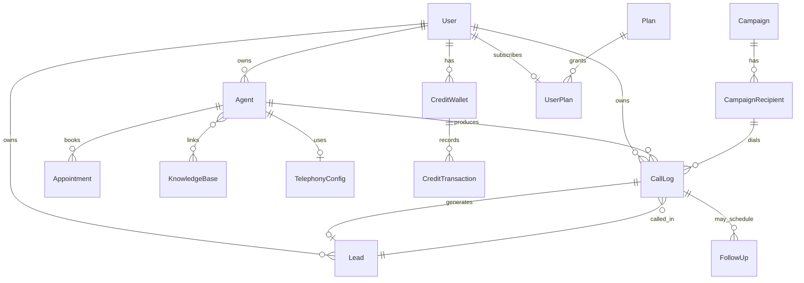

# 18 — Data Models

[← Back to index](README.md)

Reference for every Mongoose model in `backend/src/models/`. Grouped by domain. Most models carry a `userId` owner and `timestamps`.

---

## Entity-relationship overview

---

## Core voice

| Model | Purpose | Key fields |
|-------|---------|-----------|
| `Agent` | The AI persona + its Vapi assistant link | `agentName`, `systemPrompt`, `apiKeyMode`, `providerAgentId`, `vapiPhoneNumberId`, `bioPage`, `publicSlug` |
| `CallLog` | One call record | `providerCallId`, `status`/`normalizedStatus`, `durationSeconds`, `transcript`, `summary`, `recordingUrl`, `billingEnforced`/`billingSettled`/`creditsCharged`, `campaignId` |
| `ConversationTurn` | Stored conversation turns (engine history) | `conversationId`, `role`, `content` |
| `WebhookEvent` | Raw/unmatched Vapi webhook events | `provider`, `eventType`, `payload` |
| `AgentTemplate` | Prebuilt agents | `slug`, config defaults |
| `TelephonyConfig` | Twilio creds + number | `provider`, `phoneNumber`, `accountSid`, `authToken` (encrypted), `status` |

## Leads & outreach

| Model | Purpose |
|-------|---------|
| `Lead` | A contact (name, phone, email, requirement, status, source) |
| `LeadFinder` | A Lead Finder search run + results |
| `Campaign` | A voice campaign (agent + pacing + status) |
| `CampaignRecipient` | One target within a campaign (status, linked call) |
| `FollowUp` | A scheduled retry/reminder (`dueAt`, status) |
| `ScheduledCall` | A call queued for a future `runAt` |
| `Appointment` | A booking (time, status, agent, lead) |
| `ImportRun` / `ImportedCallRow` | Bulk import batches + rows |

## Email

| Model | Purpose |
|-------|---------|
| `EmailIntegration` | Connected Brevo/IMAP/Gmail (encrypted creds) |
| `EmailThread` | A conversation thread |
| `EmailMessage` | A single message in a thread |
| `EmailCampaign` | Outbound email campaign |
| `EmailLog` | Per-message send record |

## Billing & plans

| Model | Purpose |
|-------|---------|
| `CreditWallet` | A user's credit balance |
| `CreditTransaction` | Ledger entries (reserve/settle/charge/topup) |
| `UsageLog` | Per-action usage/cost record |
| `Plan` | Plan catalog entry |
| `UserPlan` | A user's active plan |
| `PlanConfig` | Global plan configuration (admin-editable) |
| `PlanChangeLog` | Plan change history |
| `Payment` | A payment (Razorpay/Stripe) |

## Integrations & config

| Model | Purpose |
|-------|---------|
| `LLMIntegration` | Connected LLM provider (BYOK key, encrypted) |
| `VoiceIntegration` | Connected voice provider (BYOK) |
| `AgentLLMConfiguration` | Per-agent LLM choice |
| `AgentVoiceConfiguration` | Per-agent voice choice |
| `UserIntegration` | Generic per-user integration record |
| `TelegramConnection` | Telegram chat ↔ user link |
| `KnowledgeBase` | Knowledge document |

## Platform / admin

| Model | Purpose |
|-------|---------|
| `User` | Account (role, status, credits, plan) |
| `AuditLog` | Admin action trail |
| `Notification` | User notifications |

---

## Conventions

- **Ownership:** most documents have `userId` and are filtered by it in every query (a user only ever sees their own data; admins bypass via `/api/admin`).
- **Secrets encrypted at rest:** Twilio tokens, LLM/voice keys, IMAP passwords are encrypted with `utils/secretCrypto.js` (`SECRET_ENCRYPTION_KEY`) and never serialized to the client.
- **Timestamps:** schemas use `{ timestamps: true }` (`createdAt`/`updatedAt`).
- **Provider correlation:** `Agent.providerAgentId` (Vapi assistant) and `CallLog.providerCallId` (Vapi call) are how webhooks match back to local records.

---

## Related
- How these are produced/consumed → each system doc, starting at **[README](README.md)**.
