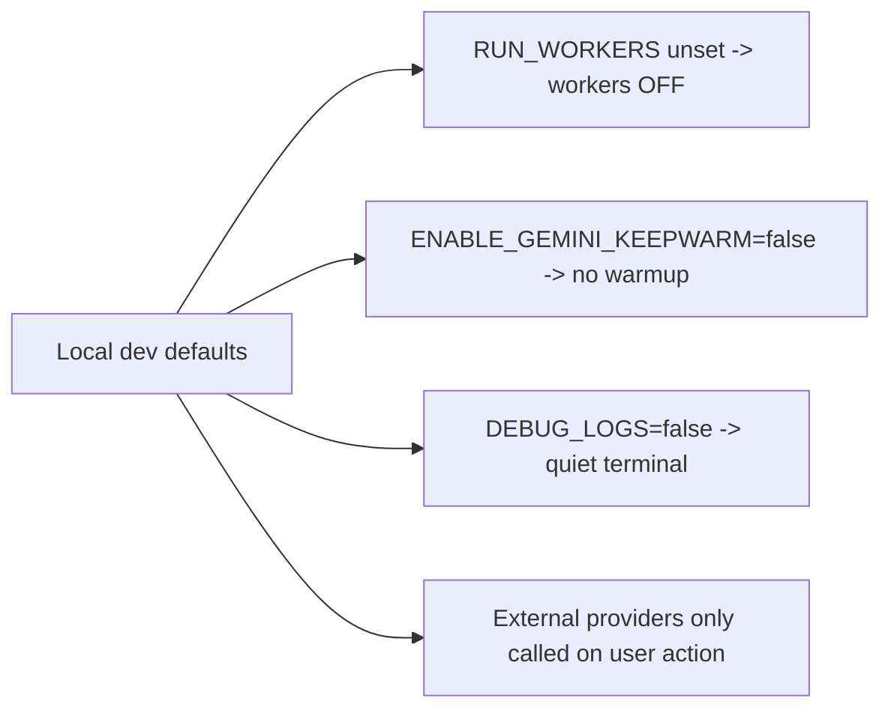
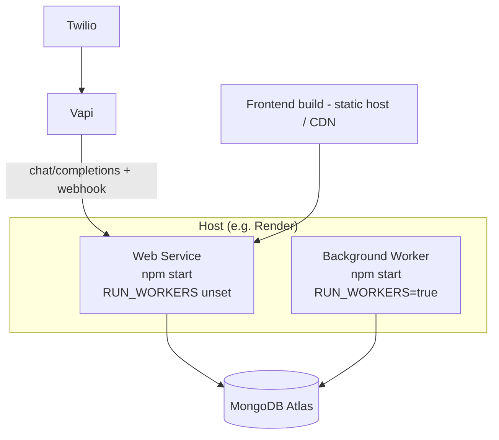

# 19 — Setup & Deployment

[← Back to index](README.md)

How to run the app locally and how it's deployed.

---

## Prerequisites

- Node.js 18+ and npm
- MongoDB (local or Atlas)
- Accounts/keys as needed: Vapi, a Twilio number, Gemini, (optional) Brevo, Razorpay/Stripe, SerpAPI

---

## Local dev

Two processes, two terminals:

```bash
# Terminal 1 — backend (http://localhost:5000)
cd backend && npm install && npm run dev

# Terminal 2 — frontend (http://localhost:5173)
cd frontend && npm install && npm run dev
```

Health check: `GET http://localhost:5000/api/health`.

### npm scripts

| Location | Script | Does |
|----------|--------|------|
| backend | `npm run dev` | nodemon (watches `src/` only) |
| backend | `npm start` | `node src/server.js` |
| backend | `npm test` | `check:no-dograh` guard + `node --test` |
| frontend | `npm run dev` | Vite dev server (port 5173) |
| frontend | `npm run build` | production build to `dist/` |
| frontend | `npm run preview` | serve the built app |

### Local is tuned to be quiet & cheap



- **Workers OFF** by default. Run them on demand: `RUN_WORKERS=true npm run dev` (PowerShell: `$env:RUN_WORKERS="true"; npm run dev`).
- **`DEBUG_LOGS=true`** prints per-request timing (`METHOD /path status - ms`) to find slow routes.
- External APIs (Gemini, Vapi, Deepgram, ElevenLabs, Brevo, SerpAPI, Stripe) are only hit when you trigger an action — never on normal dashboard load.

---

## Environment variables (backend)

Grouped by system. See `backend/.env.example` for the full list.

| Group | Vars | Notes |
|-------|------|-------|
| Core | `PORT`, `NODE_ENV`, `MONGODB_URI`, `CLIENT_URL`, `BACKEND_URL`, `PUBLIC_BACKEND_URL` | `PUBLIC_BACKEND_URL` is what Vapi calls back |
| Auth | `JWT_SECRET`, `GOOGLE_CLIENT_ID/SECRET`, `GOOGLE_REDIRECT_URI` | JWT + Google OAuth |
| Secrets | `SECRET_ENCRYPTION_KEY` | encrypts stored provider secrets |
| Vapi (Layer A) | `VAPI_PRIVATE_KEY`, `VAPI_PUBLIC_KEY`, `VAPI_BASE_URL`, `VAPI_PHONE_NUMBER_ID`, `VAPI_CUSTOM_LLM_URL`, `VAPI_WEBHOOK_SECRET`, `VAPI_DEFAULT_VOICE_ID` | `VAPI_CUSTOM_LLM_URL` → `…/api/vapi`; `VAPI_WEBHOOK_SECRET` secures the webhook |
| LLM (Layer B) | `DEFAULT_LLM_PROVIDER`, `GEMINI_API_KEY`, `GEMINI_MODEL`, `GEMINI_TEMPERATURE`, `GEMINI_MAX_TOKENS`, `OPENAI_API_KEY`, `ENABLE_GEMINI_KEEPWARM` | `gemini-2.5-flash` recommended for voice |
| Telephony | `DEFAULT_CALLER_ID_NUMBER`, `DEFAULT_TELEPHONY_PROVIDER`, `TELEPHONY_SECRET_KEY` | Twilio via Vapi |
| Billing | `CREDIT_ENFORCEMENT`, `CALL_ESTIMATED_MINUTES`, `PAYMENT_PROVIDER`, `RAZORPAY_*`, `STRIPE_*` | billing is OFF unless `CREDIT_ENFORCEMENT=true` |
| Email | `EMAIL_PROVIDER`, `BREVO_API_KEY`, `FROM_EMAIL`, `FROM_NAME`, `EMAIL_INBOUND_MODE`, `IMAP_*` | Brevo send + IMAP inbound |
| Images | `IMAGE_PROVIDER`, `KIE_API_KEY`, `KIE_*` | agent avatar generation |
| Runtime | `RUN_WORKERS`, `DEBUG_LOGS`, `SHUTDOWN_GRACE_MS`, `ENABLE_DEBUG_ROUTES` | operational toggles |

Frontend (`frontend/.env`): `VITE_API_URL=http://localhost:5000/api`.

### Env rules
- Never commit `.env`. Never expose backend secrets via `VITE_` vars.
- Different secrets for dev vs prod; rotate anything leaked.
- `JWT_SECRET`, `SECRET_ENCRYPTION_KEY`, `VAPI_WEBHOOK_SECRET` must be strong random values in production.

---

## Deployment topology

The same codebase deploys as **two services**:



- **Web service**: serves the API + real-time voice SSE. Workers OFF so background jobs never steal CPU from live calls. Handles Vapi's `/chat/completions` and `/webhook`.
- **Background worker service**: `RUN_WORKERS=true` — runs campaign, follow-up, scheduled-call, email-sync, Telegram, and pipeline workers.
- **Frontend**: `npm run build` → static `dist/` served by a static host; `VITE_API_URL` points at the web service.
- **Graceful shutdown**: on deploy (`SIGTERM`), the web service drains in-flight voice streams for up to `SHUTDOWN_GRACE_MS` so live calls aren't cut.

### Production checklist
- [ ] `NODE_ENV=production`, `PUBLIC_BACKEND_URL` set to the deployed backend
- [ ] `VAPI_CUSTOM_LLM_URL` → `https://<backend>/api/vapi`, `VAPI_WEBHOOK_SECRET` set (webhook is fail-closed without it)
- [ ] `CREDIT_ENFORCEMENT=true` if you're charging
- [ ] Payment webhook secrets (`RAZORPAY_WEBHOOK_SECRET` / `STRIPE_WEBHOOK_SECRET`) configured
- [ ] Exactly one worker service with `RUN_WORKERS=true`
- [ ] Strong `JWT_SECRET` + `SECRET_ENCRYPTION_KEY`

---

## Related
- What the workers do → **[01 — Architecture](01-architecture.md)**
- Voice callback URLs → **[05 — Vapi Webhooks & Engine](05-vapi-webhooks.md)**
