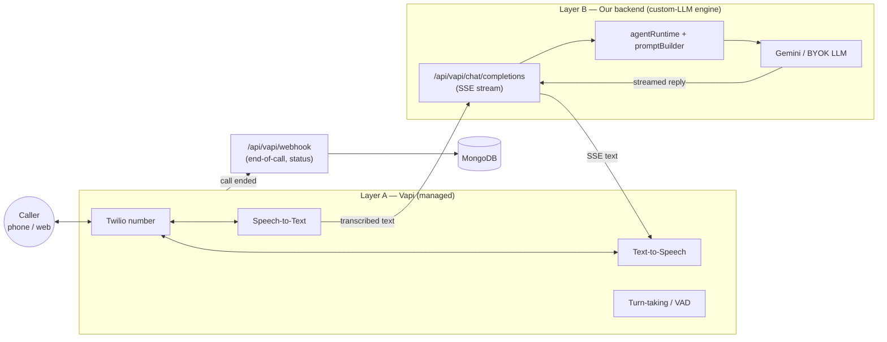
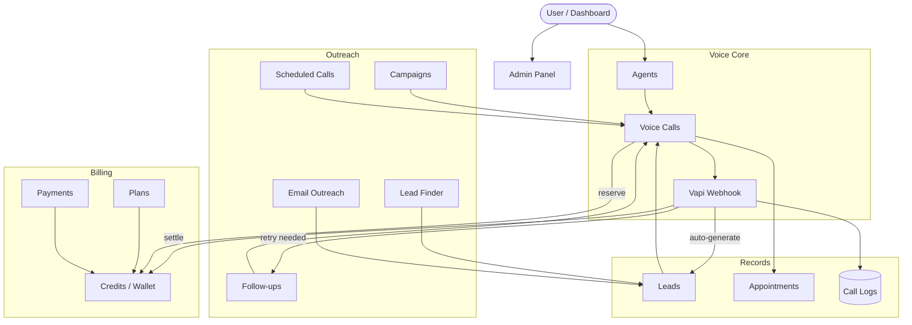

# AI Voice Agent — System Documentation

This folder documents **every system** in the AI Voice Agent platform: what it does, the files that implement it, its API endpoints, its data models, and a flowchart of how it works.

> **Note on the old root `README.md`:** the top-level `README.md` still describes a *Dograh*-based workflow. That is historical — the platform has since migrated to **Vapi + a local custom-LLM engine + Gemini**. These docs describe the **current** architecture as it exists in the code.

Diagrams use [Mermaid](https://mermaid.js.org/), which renders automatically on GitHub. If you view these files somewhere that doesn't render Mermaid, the diagrams still read fine as text.

---

## What this app is

A full-stack SaaS where a user creates **AI voice agents**, connects a phone number, and runs **outbound / inbound / web calls** in which the agent talks to a caller in real time. Around that core sit lead capture, appointments, campaigns, follow-ups, email outreach, credits/billing, and an admin panel.

**Tech stack**

| Layer | Technology |
|-------|-----------|
| Frontend | React 18 + Vite + Tailwind + React Router + TanStack Query |
| Backend | Node.js + Express (ESM), MongoDB via Mongoose |
| Voice orchestration (Layer A) | [Vapi](https://vapi.ai) (telephony, STT, TTS, turn-taking) |
| Conversation engine (Layer B) | Local custom-LLM endpoint streaming Gemini (or a user's BYOK LLM) |
| LLM | Google Gemini (default) / OpenAI-compatible BYOK |
| STT / TTS | Deepgram / ElevenLabs (via Vapi) |
| Telephony | Twilio numbers imported into Vapi |
| Email | Brevo (send) + IMAP (inbound) |
| Payments | Razorpay (default) / Stripe |
| Other | SerpAPI (lead finder), Telegram bot, KIE (agent avatar images) |

---

## The one big idea: two layers

The single most important concept in this codebase is the **two-layer voice architecture**. Understand this and everything else falls into place.

- **Layer A (Vapi)** owns the phone call: it captures audio, transcribes it, speaks our text back, and handles interruption/silence. We never touch raw audio.
- **Layer B (our backend)** is where the *brain* lives. Vapi calls our OpenAI-compatible `/api/vapi/chat/completions` endpoint on every turn; we build the prompt, stream a reply from Gemini, and send it back as Server-Sent Events.
- When the call ends, Vapi POSTs `/api/vapi/webhook`, which is where we **settle billing, save the transcript, and generate a lead**.

See **[04 — Voice Calls](04-voice-calls.md)** and **[05 — Vapi Webhooks & Engine](05-vapi-webhooks.md)** for the full detail.

---

## System catalog

Each system has its own doc. Start with Architecture, then read whichever system you need.

| # | System | What it covers |
|---|--------|----------------|
| 01 | [Architecture & Runtime](01-architecture.md) | Two-layer design, request lifecycle, startup, background workers, graceful shutdown |
| 02 | [Authentication & Users](02-authentication.md) | Email/password + Google OAuth, JWT, `protect`/admin guards, impersonation |
| 03 | [Agents](03-agents.md) | Agent model, create/edit, prompt generation, Vapi assistant sync, templates, `apiKeyMode` |
| 04 | [Voice Calls](04-voice-calls.md) | Outbound / web / inbound call flows end-to-end |
| 05 | [Vapi Webhooks & Engine](05-vapi-webhooks.md) | `/chat/completions` streaming engine + `/webhook` end-of-call handling |
| 06 | [Leads](06-leads.md) | Lead CRUD, auto-generation from calls, Lead Finder, call import |
| 07 | [Appointments](07-appointments.md) | Booking, reschedule, cancel, complete; public booking |
| 08 | [Campaigns (Voice)](08-campaigns.md) | Bulk outbound campaigns, recipients, campaign worker |
| 09 | [Follow-ups & Scheduled Calls](09-followups-scheduled.md) | Auto-retries, scheduled calls, their workers |
| 10 | [Billing & Credits](10-billing-credits.md) | Wallet/ledger, reserve→settle, plans, payments & webhooks |
| 11 | [Email](11-email.md) | Inbox (IMAP), outreach campaigns, threads, Brevo/Gmail integration |
| 12 | [Telephony](12-telephony.md) | Twilio→Vapi import, telephony configs, inbound routing |
| 13 | [Provider Integrations](13-integrations.md) | LLM BYOK, Voice BYOK, `apiKeyMode`, Telegram |
| 14 | [Knowledge Base](14-knowledge-base.md) | Uploading knowledge, linking to agents |
| 15 | [Bio Pages & Public Agent](15-bio-pages-public.md) | Public landing pages, public chat & web call, sharing |
| 16 | [Admin Panel](16-admin.md) | User/agent/plan management, impersonation, audit logs |
| 17 | [Frontend](17-frontend.md) | React app structure, routing, data fetching, key pages |
| 18 | [Data Models](18-data-models.md) | Reference for every Mongoose model |
| 19 | [Setup & Deployment](19-setup-deployment.md) | Env vars, local dev, workers, deployment |

---

## How the systems connect (the big map)

**Read next:** [01 — Architecture & Runtime](01-architecture.md).
