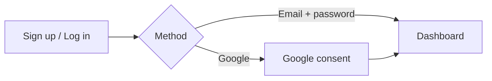
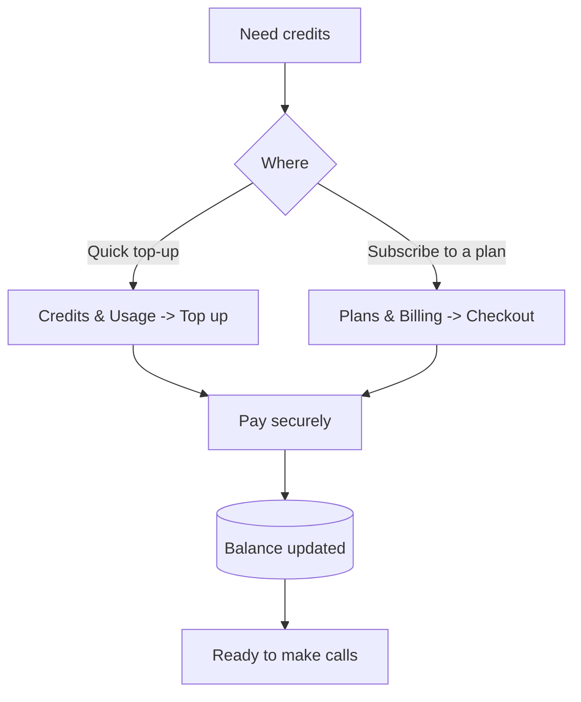

# 1 — Getting Started

[← Tutorial index](README.md) · Next: [Connect Integrations →](02-integrations.md)

Create your account, find your way around, and top up credits.

---

## 1.1 Create an account & log in

1. Open the app and go to the **Sign up** page (`/signup`).
2. Enter your **name**, **email**, and a **password**, then submit.
3. You're taken into the dashboard. Next time, use **Log in** (`/login`).

**Prefer Google?** On the login page click **Continue with Google** — you'll be redirected to Google, then straight back into the app. No password needed.

Your session is remembered on this browser. Use **Logout** (bottom-left of the sidebar) to sign out.

---

## 1.2 The dashboard

After logging in you land on **Dashboard**. It shows your key numbers at a glance: total agents, active agents, total leads, total calls, recent activity, and usage. Use it as your home base.

---

## 1.3 The sidebar (your map of the app)

Everything is reachable from the left sidebar, grouped into sections:

| Section | Items |
|---------|-------|
| **WORKSPACE** | Dashboard |
| **BUILD** | Agents · Campaigns · Leads · Lead Finder · Templates · Voice & Language |
| **TEST** | Call Logs |
| **OBSERVE** | Messages · Email Inbox · Follow-ups · Appointments · Import Calls |
| **MANAGE** | Email Campaign · Integrations · Telephony Configuration · Credits & Usage · Plans & Billing · Settings |

Tips:
- The **search bar** at the top finds agents, leads, and calls instantly — just start typing.
- The **Credits chip** at the bottom-left shows your balance; click it to top up.
- You can **collapse** the sidebar with the panel icon to get more space.
- Admins see an extra **Admin** item.

---

## 1.4 Credits & billing

Calls are paid for with **credits** from your wallet. Two menu items handle money:

- **Credits & Usage** — see your balance, usage history, and **top up** credits.
- **Plans & Billing** — pick a plan and checkout (Razorpay or Stripe).

How credits are spent on a call:
- Before a call starts, the app **reserves** an estimated cost. If your balance can't cover **even one minute**, the call is blocked with an "insufficient credits" message.
- After the call ends, you're charged for the **actual minutes used** (rounded up). Calls that never connect (no answer / busy / failed) are **not** charged.

> If you're just testing and billing isn't enabled on your instance, calls are free and you can skip this section.

---

## Next step

Now connect the tools your agent needs — most importantly a **phone number**.

→ **[2. Connect Integrations](02-integrations.md)**
