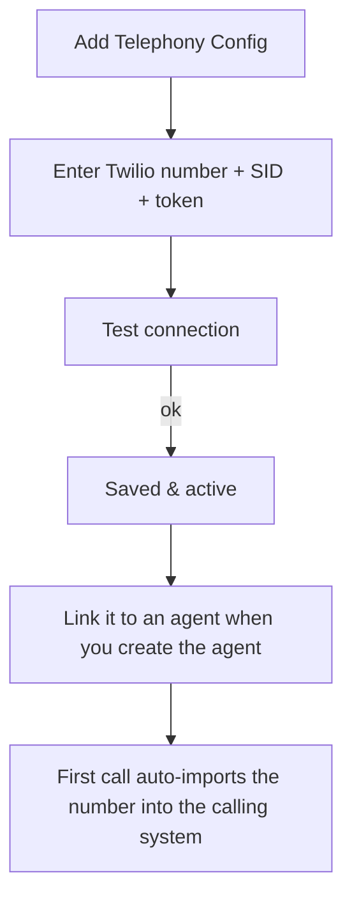
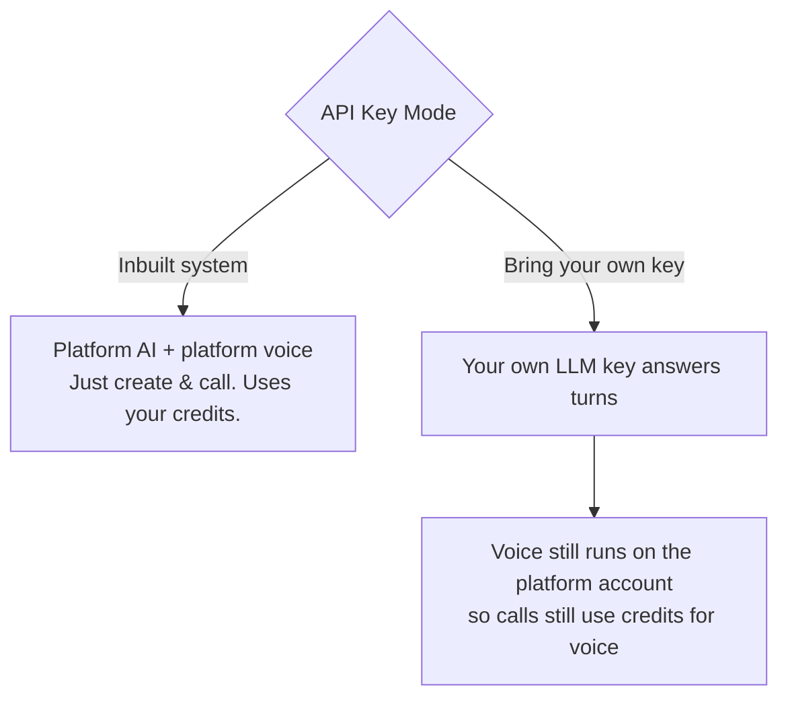

# 2 — Connect Integrations

[← Getting Started](01-getting-started.md) · [Tutorial index](README.md) · Next: [Create an Agent →](03-create-agent.md)

Connect the tools your agent uses. Only **one** is required (a phone number); the rest are optional.

| Integration | Required? | Menu | Why |
|-------------|-----------|------|-----|
| **Telephony** (Twilio number) | ✅ Required for real phone calls | **Telephony Configuration** | The number your agent calls from |
| **LLM** (AI brain) | Optional (BYOK) | **Integrations** | Use your own AI key instead of the platform's |
| **Voice** (text-to-speech) | Optional (BYOK) | **Integrations** | Use your own voice provider account |
| **Email** (Brevo / IMAP / Gmail) | Optional | **Settings → Email** | Send & receive emails |

> **Don't want to connect AI/voice keys?** You don't have to. The app's **Inbuilt system (Default System)** mode uses platform AI + voice out of the box. You still need a phone number for real calls.

---

## 2.1 Telephony — add your phone number (required for calls)

Calls run on **your own Twilio number**, imported into the calling system automatically.

1. Open **Telephony Configuration** from the sidebar.
2. Click **Add / New configuration**.
3. Enter a **name**, choose provider **Twilio**, and fill in:
   - **Phone number** in E.164 format, e.g. `+17578297060`
   - **Twilio Account SID**
   - **Twilio Auth Token**
4. Save, then click **Test** to verify the credentials work.
5. (Optional) **Configure Webhook** and **Verify Inbound Routing** if you also want to receive **incoming** calls on this number.

**What happens behind the scenes:** the first time an agent with this config places a call, the app imports your Twilio number into the calling provider and reuses it forever after — no manual dashboard steps.

> Your Twilio Auth Token is stored **encrypted** and is never shown back to you or the browser.

---

## 2.2 Understand "Inbuilt system" vs "Bring your own key" (BYOK)

Every agent has an **API Key Mode** (you pick it in the agent builder, Step 5):

- **Inbuilt system (Default System)** — easiest. Platform AI + platform voice. Nothing to connect. Recommended for getting started.
- **Bring your own key (BYOK)** — the AI answers using **your** connected LLM account. You must connect an LLM integration first (below). Voice always runs on the platform, so calls still use credits.

> With BYOK, if your key is missing or invalid, the call **won't start** and **no credits are used** — you'll get a clear error instead of a silent failure.

---

## 2.3 LLM integration (optional — for BYOK)

1. Open **Integrations** from the sidebar.
2. Find the **LLM** section, pick a provider, and click **Connect**.
3. Paste your **API key** and save.
4. Click **Test** to validate; optionally **list models** and run a **test completion**.

Once connected, you can select this account per-agent (agent builder Step 5, or the agent's **Voice & Language → LLM** tab). Keys are encrypted at rest.

---

## 2.4 Voice integration (optional — for BYOK)

1. In **Integrations**, find the **Voice** section, choose a provider, and **Connect** with your key.
2. Browse **voices** and **models**, and use **Preview** to hear a sample.
3. Pick a voice per agent in the agent's voice settings.

---

## 2.5 Email (optional)

To send and receive email from the app, open **Settings → Email**:

- **Brevo** — connect your Brevo API key and choose a verified **sender** (for sending campaigns/replies).
- **IMAP** — connect a mailbox (host, user, app password) so incoming replies are pulled in.
- **Gmail** — connect via Google.

See [Guide 5 → Email](05-features.md#email) for using the inbox and campaigns.

---

## Checklist before creating an agent

- [ ] A **Telephony Configuration** added and **tested** (for real phone calls).
- [ ] (Optional) An **LLM** and/or **Voice** integration connected, if you want BYOK.
- [ ] (Optional) **Email** connected, if you'll use email outreach.

→ **[3. Create an Agent](03-create-agent.md)**
