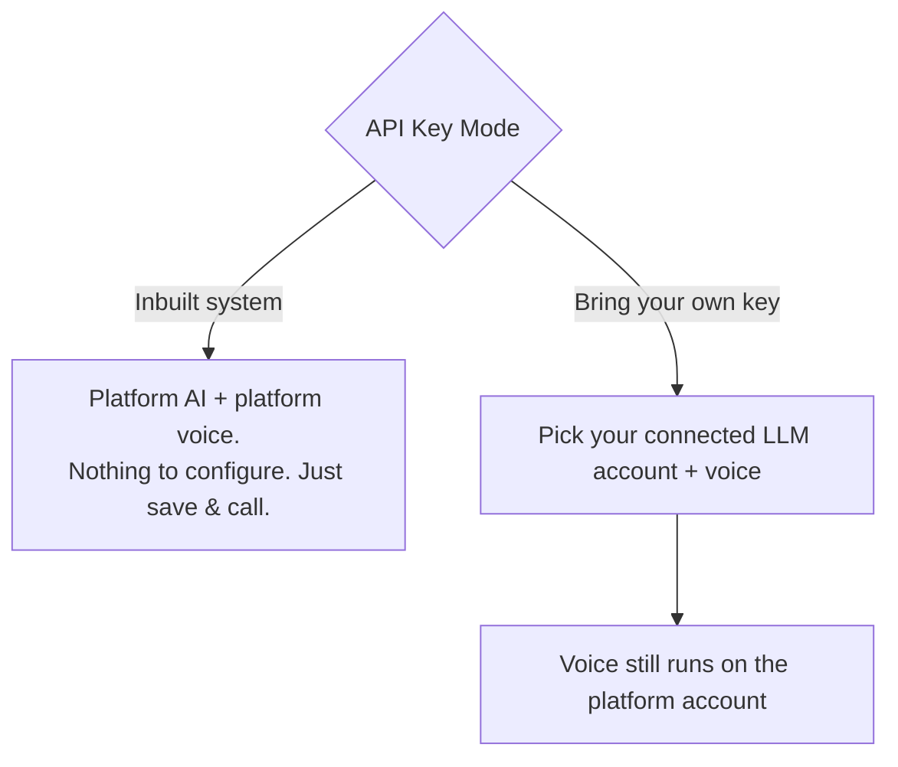

# 3 — Create an Agent

[← Connect Integrations](02-integrations.md) · [Tutorial index](README.md) · Next: [Make Calls →](04-make-calls.md)

An **Agent** is your AI caller: it knows your business, follows your rules, and speaks in a voice you choose. You build it with a **6-step wizard**.

To start: sidebar → **Agents** → **Create Agent** (or **Create Agent** directly). Use **Next / Back** to move between steps; you can also click any step number at the top to jump around. A progress bar shows how far along you are.

---

## Step 1 — Choose Template

Pick a ready-made starting point that matches your use case (e.g. a receptionist, sales follow-up, etc.).

- Select from the **Template** dropdown, **or** click one of the **type cards**.
- Choosing a template pre-fills sensible defaults for the later steps. You can change everything afterward.

> This just seeds the form — nothing is locked in.

---

## Step 2 — Business Information

Tell the agent who it represents and how it will call.

| Field | What to enter |
|-------|---------------|
| **Provider** | Leave as **Vapi** (the live calling engine). "Custom Engine" is for advanced/local-only use. |
| **Telephony Configuration** | Select the Twilio number you added in [Guide 2](02-integrations.md). Required for real outbound phone calls. |
| **Image Mode** | How the agent's avatar is made: **Auto Generate**, **Upload Custom Image**, or **Use Default Avatar**. |
| **Agent Name** | A clear internal name, e.g. `Real Estate Follow-Up Agent`. **(required)** |
| **Business Name** | Your business, e.g. `ABC Properties`. **(required)** |
| **Business Category** | e.g. `Real Estate`. |
| **Business Website / Location / Contact Number** | Optional business details. |
| **Business Description** | A short paragraph on what the business does. |

> **Required to create the agent:** Agent Type (from Step 1), **Agent Name**, and **Business Name**.

---

## Step 3 — Services & FAQs (the agent's knowledge)

This is the agent's "brain food" — everything it can talk about. Fill in what's relevant:

- **Services**, **Pricing**, **FAQs**, **Policies**, **Offers**, **Additional Information**.

The more accurate detail you add, the better and more grounded the agent's answers will be during a call.

---

## Step 4 — Agent Behavior (rules + lead capture)

Control how the agent behaves and what it collects.

| Field | Purpose |
|-------|---------|
| **Main Goal** | The primary objective, e.g. "Book appointments and answer questions." |
| **Secondary Goal** | e.g. "Capture name, phone, and requirement." |
| **Avoid Instructions** | Things the agent must never do (e.g. "Don't give false information"). |
| **Confused Instructions** | What to do when it can't answer (e.g. "Say the team will call back"). |
| **Fallback Message** | Spoken when it doesn't know something. |
| **First Message** | The opening line when the call connects. Keep it short & natural. |
| **Ending Message** | How it wraps up the call. |
| **Human Transfer Message** | What it says when it can't help and a human should follow up. |
| **Call Summary Format** | How the post-call summary should be written. |

### Lead Capture Questions
Below the fields, define the **questions the agent should get answered** on each call (name, phone, requirement, etc.):
- Each question has a **label**, a **field name**, and a **Required** toggle.
- **Add Question** to add more; the **✕** removes one.

These become the structured data captured as a **Lead** after the call.

---

## Step 5 — Language & Voice

Choose how the agent sounds and which AI runs it.

1. **Conversation Language** — e.g. English, Hindi, Hinglish.
2. **Tone** and **Personality** — e.g. Professional / Polite.
3. **API Key Mode** toggle:

- **Inbuilt system** (recommended to start): a note confirms "platform defaults" — just proceed. Credits are used per call.
- **Bring your own key**: an **LLM configuration** panel and a **Voice configuration** panel appear — choose your connected account and a voice. (Connect them first via [Guide 2](02-integrations.md).) A reminder notes that if your key is missing/invalid the call won't start and no credits are used.

---

## Step 6 — Review & Create

You'll see a summary card of everything (type, provider, business, goal, knowledge, lead questions, voice, rules).

- Check it looks right (use **Back** to fix anything).
- Click **Create Agent**.

After creation you're taken to the **Agent Details** page. A calling assistant is created automatically in the background — give it a moment to finish syncing before placing a call.

---

## Editing later

Open **Agents** → click your agent → **Edit**. You can change any field and save; it updates the **same** agent and calling assistant (no duplicates). The edit screen is organized into tabs: Basic Info, Business Information, System Prompt, Call Behavior, Voice & Language, and Calling System.

→ **[4. Make Calls](04-make-calls.md)**
