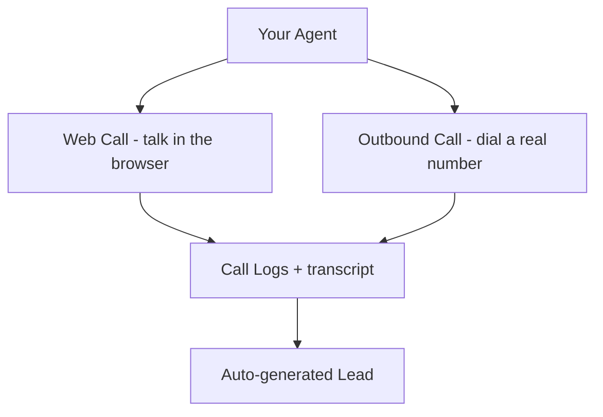
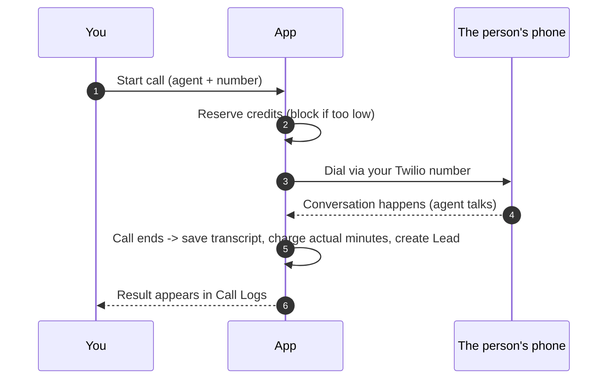

# 4 — Make Calls

[← Create an Agent](03-create-agent.md) · [Tutorial index](README.md) · Next: [Use the Features →](05-features.md)

Three ways to talk to your agent: a **Web Call** (in your browser), a **Test/Outbound Call** (to a real phone), and reading the **results** afterward.

---

## 4.1 Web Call — quickest way to try it

Best for testing the prompt and voice without spending on telephony.

1. Open **Agents** → click your agent → open the **Test** page (or **Web Call**).
2. Allow **microphone access** when the browser asks.
3. Click **Start Call** and **speak** — the agent hears you and replies in its voice.
4. Click **End Call** when done.

Use this to check: does it follow its role? Is the voice clear? Does it ask your lead-capture questions? Does it stop when you interrupt?

---

## 4.2 Outbound Call — call a real phone

**Before you start, make sure:**
- The agent has a **Telephony Configuration** linked ([Guide 2](02-integrations.md)).
- You have **credits** (if billing is on) — [Guide 1](01-getting-started.md).
- The agent has finished syncing (created a moment ago? give it a few seconds).

**Two ways to place it:**

**A) Quick test call from the agent**
1. Open the agent's page.
2. Use **Test Call** / **Outbound Call**, enter the destination number in E.164 format (e.g. `+9198XXXXXXXX`), and start.

**B) Call a saved lead** (the normal workflow)
1. Open **Leads**, find the person.
2. Click **Call again** (or select the lead and start a call).

**If a call won't start**, the message usually tells you why:
- *Insufficient credits* → top up in **Credits & Usage**.
- *Agent not synced yet* → wait a few seconds and retry.
- *Link a Twilio config* → add/link a **Telephony Configuration**.
- *BYOK key invalid* → fix your LLM key in **Integrations** (no credits were used).

---

## 4.3 Read the results — Call Logs

Open **Call Logs** from the sidebar to see every call.

Each call record shows:
- **Status / outcome** (completed, no-answer, busy, failed…)
- **Duration** and **credits charged**
- **Transcript** of the conversation (when available)
- **Recording** (download where available)
- The **agent** and **number** involved

Handy per-call actions:
- **Sync** — pull the latest details/transcript from the calling system.
- **Retry** — call again.
- **Extract Lead** — turn this call into a lead manually.

> **Automatic leads:** when a call ends, the app reads the transcript and creates a **Lead** for you (name, phone, requirement, etc.) — even if the agent didn't capture structured fields. Find them under **Leads**.

---

## 4.4 Inbound calls (optional)

If you configured inbound routing on your Telephony number ([Guide 2](02-integrations.md)), people can **dial your number** and your agent answers automatically — same brain, same transcript, same auto-lead.

→ **[5. Use the Features](05-features.md)**
