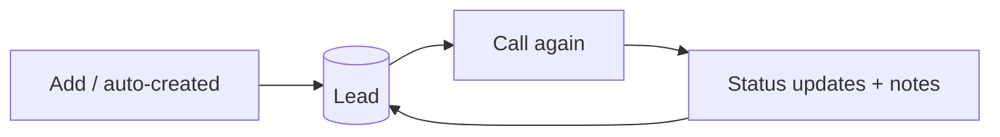
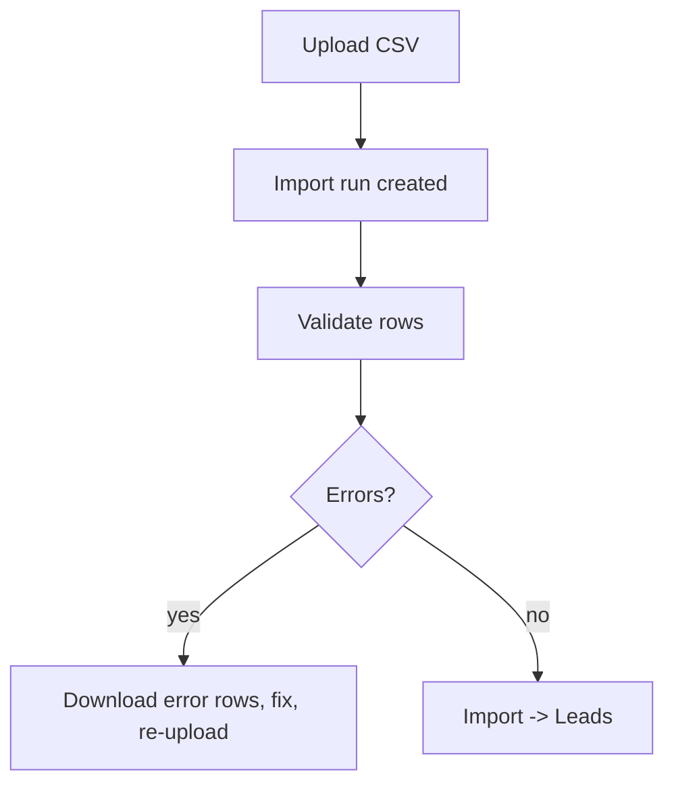
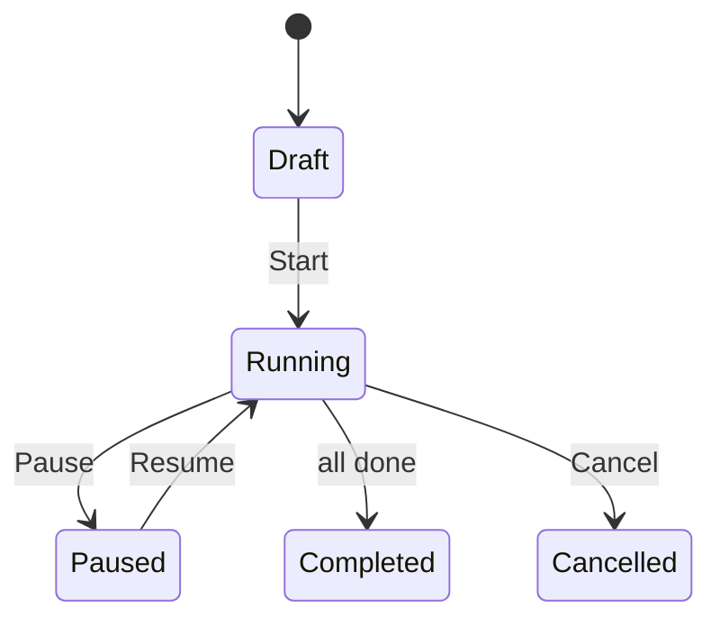
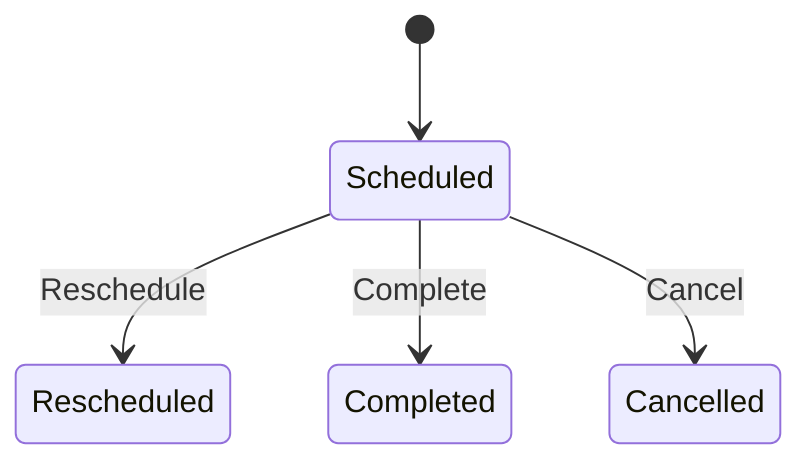
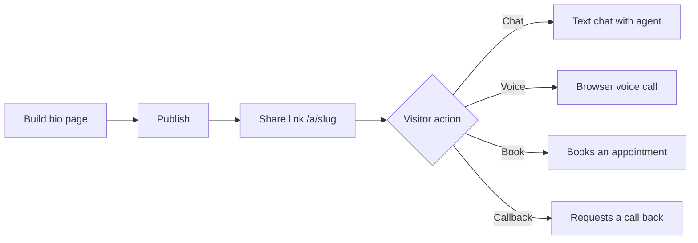
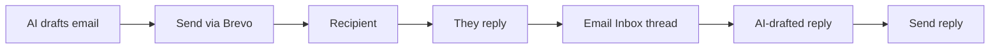
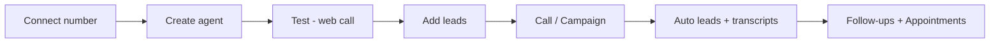

# 5 — Use the Features

[← Make Calls](04-make-calls.md) · [Tutorial index](README.md)

A tour of every feature in the sidebar and how to use it. Jump to what you need:

- [Leads](#leads) · [Lead Finder](#lead-finder) · [Import Calls](#import-calls)
- [Campaigns](#campaigns) · [Follow-ups](#follow-ups) · [Appointments](#appointments)
- [Public Agent Page](#public-agent-page) · [Templates](#templates)
- [Email](#email) · [Knowledge Base](#knowledge-base)
- [Voice & Language](#voice--language) · [Credits & Billing](#credits--billing) · [Settings](#settings)

---

## Leads

Your contact list. Menu: **Leads**.

- **Add a lead**: name, phone (with country code), email, requirement, source, assigned agent, status.
- **Filter / search** by status or text; **export** to CSV.
- **Call again**: place a call to that lead right from the list.
- Leads are also **created automatically** after each call (see [Make Calls](04-make-calls.md)).

**Lead statuses** flow like: `New → Contacted → Interested / Not Interested → Follow-Up → Converted`.

---

## Lead Finder

Discover **new** leads instead of typing them in. Menu: **Lead Finder**.

1. Choose a provider and enter a **search** (e.g. "dentists in Mumbai").
2. Review the results of the **run**.
3. Optionally **enrich emails** to find contact addresses.
4. **Save** the ones you want — they become Leads you can call.

---

## Import Calls

Bulk-load contacts/calls from a file. Menu: **Import Calls**.

Keep phone numbers in international format. You can download the **error rows** to fix and re-upload.

---

## Campaigns

Call **many** people with one agent, paced automatically. Menu: **Campaigns**.

1. **Create** a campaign and pick the agent.
2. **Add leads** as recipients (or **import recipients**).
3. **Start** — the system calls recipients in the background.
4. Watch progress under **recipients** / **stats**; **pause**, **resume**, or **cancel** anytime.
5. **Retry failed** to re-attempt calls that didn't connect.

Every campaign call uses credits just like a normal call, and each result updates that recipient's status.

---

## Follow-ups

Automatic (or manual) **retries** and reminders. Menu: **Follow-ups**.

- When a call **doesn't connect** (no answer / busy), the app can schedule a **follow-up** to try again later.
- You can also create follow-ups manually, **run now**, **reschedule**, or **cancel**.

---

## Appointments

Bookings made from the dashboard or by visitors on your agent's public page. Menu: **Appointments**.

- **Create** an appointment (time, agent, lead).
- **Reschedule**, **Cancel**, or mark **Complete**.

---

## Public Agent Page

Give your agent a **shareable web page** where anyone can chat, start a voice call, or book — no login.

1. Open your agent → **Bio Page** builder (`/agents/:id/bio-page`).
2. Pick a **layout/template**, set colors, logo, cover, headline, and which buttons show (chat, voice call, appointment, contact form).
3. **Publish** it. Share the link (`/a/your-agent-slug`).
4. Manage the shareable link / embed under the agent's **share settings**.

---

## Templates

Menu: **Templates**. Browse ready-made agent setups. Use one as the starting point for a new agent (same as Step 1 of the [agent builder](03-create-agent.md)).

---

## Email

Two-way email. Menus: **Email Inbox**, **Email Campaign**, and **Settings → Email** (to connect providers — see [Guide 2](02-integrations.md#25-email-optional)).

**Send (outbound):**
1. In **Email Campaign**, generate a message (the AI can draft it), review, and send — as a single email or a campaign to many recipients.
2. Sends go through your connected **Brevo** sender.

**Receive (inbound):**
1. Connect **IMAP** (or a Brevo inbound webhook) so replies come into **Email Inbox**.
2. Open a thread, click **Generate reply** for an AI draft, edit, and **Reply**.

The **Email Inbox** item shows a red dot when you have unread messages.

---

## Knowledge Base

Menu: **Knowledge** (under BUILD via the Knowledge page). Add reference documents (title + content) and link them to an agent so it can answer domain-specific questions with your material. Attach knowledge to an agent from the agent's settings.

---

## Voice & Language

Menu: **Voice & Language**. A central place to manage language, tone, and voice defaults, and preview provider voices before assigning them to agents. (You can also set these per agent in the builder, Step 5.)

---

## Credits & Billing

- **Credits & Usage** — balance, usage history, and **top up**.
- **Plans & Billing** — choose a plan and pay (Razorpay/Stripe).

See [Getting Started → Credits](01-getting-started.md#14-credits--billing) for how charging works (reserve before, charge actual minutes after, no charge for unconnected calls).

---

## Settings

Menu: **Settings**. Your account and app preferences, including **Settings → Email** for email provider connections.

---

## You're set 🎉

You now know how to sign in, connect a number, build an agent, make calls, and use every feature. Recap of a full workflow:

← Back to the [Tutorial index](README.md) · Technical details in the [system docs](../README.md).
