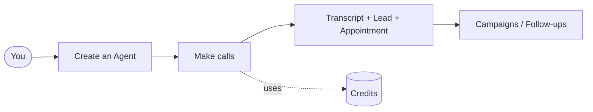
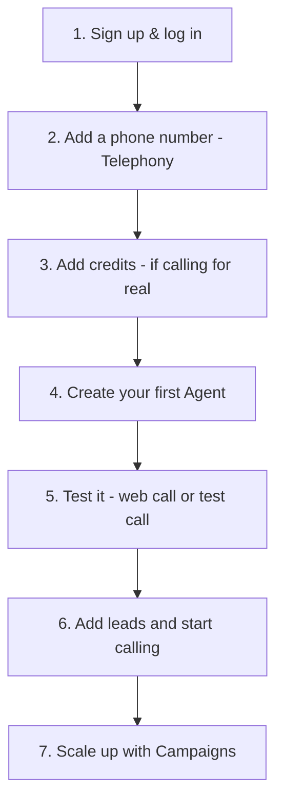

# AI Voice Agent — User Tutorial

A step-by-step guide to using the app: sign in, connect your tools, build an AI voice agent, make calls, and use every feature. Written for **end users** (no coding needed).

> Looking for how the system works under the hood? See the [technical docs](../README.md).

---

## The 5-minute mental model

You build an **Agent** (an AI persona for your business). That agent can **call people** (or answer calls / chat on a public page) and talk to them in a real voice. Every call is saved with a **transcript**, and the app can turn a call into a **Lead** and even book an **Appointment**. You do bulk calling with **Campaigns**, and you pay for calls with **Credits**.

---

## Tutorial chapters

| # | Guide | You'll learn |
|---|-------|--------------|
| 1 | [Getting Started](01-getting-started.md) | Sign up / log in, the dashboard, the sidebar, adding credits |
| 2 | [Connect Integrations](02-integrations.md) | LLM keys, voice, telephony (phone number), email |
| 3 | [Create an Agent](03-create-agent.md) | The full 6-step agent builder |
| 4 | [Make Calls](04-make-calls.md) | Test call, web call, real outbound call, reading results |
| 5 | [Use the Features](05-features.md) | Leads, Lead Finder, Campaigns, Follow-ups, Appointments, Import, Public Page, Email, Knowledge |

---

## Recommended order (first-time setup)

**Minimum to make your first real call:**
1. A **Telephony Configuration** (your Twilio number) — [Guide 2](02-integrations.md).
2. **Credits** in your wallet (if billing is enabled) — [Guide 1](01-getting-started.md).
3. An **Agent** — [Guide 3](03-create-agent.md).
4. A phone number to call (a **Lead**) — [Guide 5](05-features.md).

> **Good news:** the app ships with **Inbuilt system (Default System)** mode, so you can create an agent and start calling **without** connecting your own AI/voice keys. You only need the telephony (phone number) part. Connecting your own keys (BYOK) is optional — see [Guide 2](02-integrations.md).

Start here → **[1. Getting Started](01-getting-started.md)**
